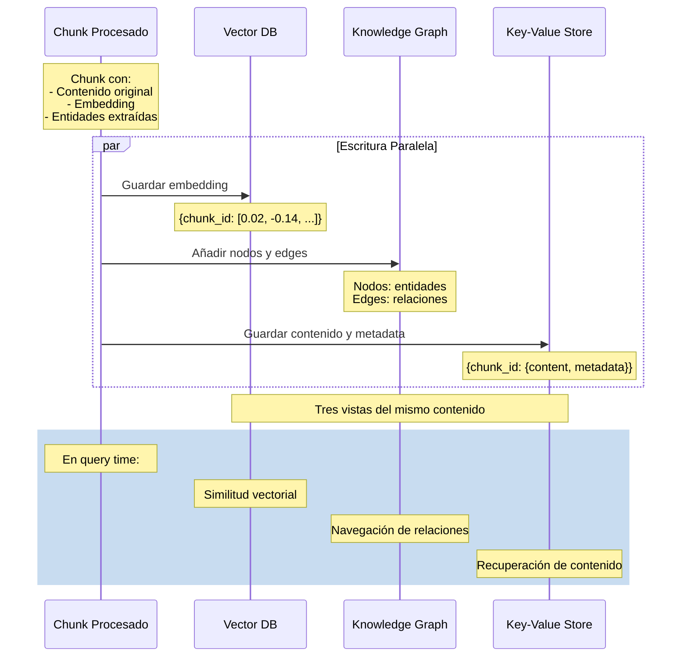
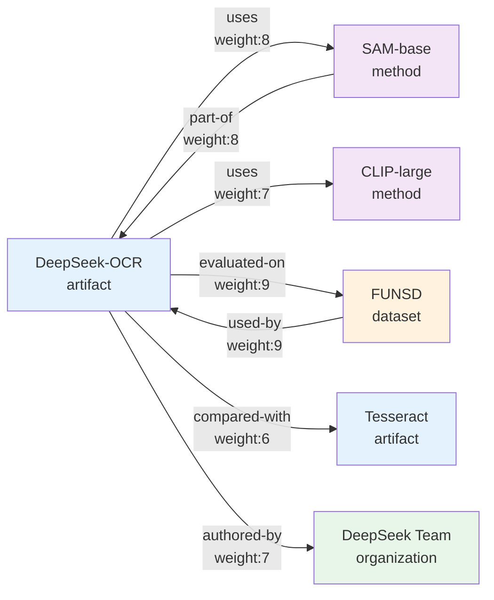

# Bases de Datos

## Tabla de Contenidos

1. [Introducción](#introducción)
2. [Arquitectura de Storage](#arquitectura-de-storage)
3. [Vector Database](#vector-database)
4. [Knowledge Graph](#knowledge-graph)
5. [Key-Value Store](#key-value-store)
6. [Integración y Consultas](#integración-y-consultas)
7. [Persistencia y Escalabilidad](#persistencia-y-escalabilidad)

---

## Introducción

El sistema utiliza una arquitectura de triple storage que combina tres tipos de bases de datos complementarias. Esta decisión arquitectónica no es arbitraria sino que responde a diferentes necesidades de acceso y consulta del conocimiento indexado.

### Por Qué Tres Bases de Datos

Cada tipo de base de datos está optimizada para un tipo específico de consulta:

**Vector Database**: Búsqueda por similitud semántica
- Pregunta: "¿Qué información es similar a mi query?"
- Operación: Cálculo de distancias en espacio vectorial
- Fuerza: Captura significado difuso

**Knowledge Graph**: Navegación de relaciones explícitas
- Pregunta: "¿Cómo se relaciona A con B?"
- Operación: Traversal de nodos y edges
- Fuerza: Relaciones estructuradas y multi-hop reasoning

**Key-Value Store**: Recuperación rápida de contenido
- Pregunta: "Dame el contenido del chunk X"
- Operación: Lookup directo por ID
- Fuerza: Acceso O(1) a datos crudos

### Principio de Diseño

```
Un mismo contenido se almacena en tres representaciones:

Texto original: "DeepSeek-OCR uses SAM-base"

→ Vector DB: [0.023, -0.145, 0.892, ..., 0.234]
→ Knowledge Graph: [DeepSeek-OCR] --uses--> [SAM-base]
→ Key-Value Store: {"chunk-abc": "DeepSeek-OCR uses SAM-base"}
```

Cada representación sirve un propósito diferente en el retrieval.

---

## Arquitectura de Storage

```mermaid
graph TB
    CONTENT[Contenido Procesado]
    
    subgraph "Triple Storage System"
        VDB[Vector Database<br/>Nano Vector DB]
        GRAPH[Knowledge Graph<br/>NetworkX]
        KV[Key-Value Store<br/>JSON Files]
    end
    
    CONTENT --> VDB
    CONTENT --> GRAPH
    CONTENT --> KV
    
    subgraph "Vector DB Storage"
        V1[vdb_entities.json<br/>169 entidades]
        V2[vdb_chunks.json<br/>13 chunks de texto]
        V3[vdb_relationships.json<br/>313 relaciones]
    end
    
    subgraph "Graph Storage"
        G1[graph_chunk_entity_relation.graphml]
        G2[Nodos: 199<br/>Entidades únicas]
        G3[Edges: 364<br/>Relaciones tipadas]
    end
    
    subgraph "KV Storage"
        K1[kv_store_full_docs.json<br/>Documentos completos]
        K2[kv_store_text_chunks.json<br/>Chunks indexados]
        K3[kv_store_llm_response_cache.json<br/>Cache de respuestas]
    end
    
    VDB --> V1
    VDB --> V2
    VDB --> V3
    
    GRAPH --> G1
    G1 --> G2
    G1 --> G3
    
    KV --> K1
    KV --> K2
    KV --> K3
    
    subgraph "Query Engine"
        QUERY[User Query]
        HYBRID[Hybrid Search]
    end
    
    QUERY --> HYBRID
    
    V1 --> HYBRID
    V2 --> HYBRID
    V3 --> HYBRID
    G2 --> HYBRID
    G3 --> HYBRID
    K1 --> HYBRID
    K2 --> HYBRID
    
    HYBRID --> RESPONSE[Respuesta Final]
    
    style "Triple Storage System" fill:#E3F2FD
    style "Vector DB Storage" fill:#F3E5F5
    style "Graph Storage" fill:#FFF3E0
    style "KV Storage" fill:#E8F5E9
```

### Estructura de Directorios

```
storage/
└── rag_storage/
    ├── graph_chunk_entity_relation.graphml   # 2.5 MB
    ├── vdb_entities.json                     # 4.1 MB
    ├── vdb_chunks.json                       # 3.2 MB
    ├── vdb_relationships.json                # 5.3 MB
    ├── kv_store_full_docs.json              # 1.8 MB
    ├── kv_store_text_chunks.json            # 2.9 MB
    ├── kv_store_llm_response_cache.json     # 0.5 MB
    └── doc_status.json                       # 0.1 MB
    
Total: ~20 MB para un documento de 10 páginas
```

### Flujo de Datos



---

## Vector Database

### Descripción General

El Vector Database almacena representaciones vectoriales (embeddings) del contenido. Utiliza Nano Vector DB, una implementación ligera diseñada para deployment local.

#### Características de Nano Vector DB

```
Implementación: Python nativo con NumPy
Storage: JSON files (persistencia en disco)
Indexación: Flat index (búsqueda exhaustiva)
Distancia: Similitud coseno
Tamaño en memoria: Todos los vectores se cargan en RAM
Velocidad: ~1-2ms por query en 1000 vectores
```

### Estructura de Datos

#### Formato de Almacenamiento

Los vectores se guardan en archivos JSON con estructura específica:

```json
{
  "vectors": {
    "chunk-abc123": {
      "embedding": [0.023, -0.145, 0.892, ..., 0.234],
      "metadata": {
        "type": "text_chunk",
        "doc_id": "doc-xyz789",
        "chunk_order": 1,
        "tokens": 487,
        "created_at": 1763128318
      }
    },
    "entity-DeepSeek-OCR": {
      "embedding": [0.112, -0.034, 0.723, ..., 0.445],
      "metadata": {
        "type": "entity",
        "entity_name": "DeepSeek-OCR",
        "entity_type": "artifact",
        "description": "OCR model for document parsing",
        "created_at": 1763128320
      }
    }
  },
  "metadata": {
    "dimension": 1024,
    "count": 169,
    "model": "bge-m3",
    "last_updated": 1763128350
  }
}
```

### Tres Colecciones Vectoriales

El sistema mantiene tres colecciones separadas:

#### 1. vdb_chunks.json

Almacena embeddings de chunks de texto completos.

**Propósito**: Búsqueda semántica de fragmentos de contenido

**Contenido**:
```json
{
  "vectors": {
    "chunk-7fe438c1": {
      "embedding": [1024 floats],
      "metadata": {
        "type": "text_chunk",
        "content_preview": "DeepSeek-OCR: All-in-One...",
        "doc_id": "doc-393ccdd5",
        "file_path": "deepseek-ocr-paper.pdf",
        "chunk_order": 1,
        "tokens": 487,
        "page": 1
      }
    }
  }
}
```

**Casos de uso**:
- Query: "¿Qué dice el documento sobre arquitectura?"
- Buscar chunks cuyo embedding sea similar al embedding de la query
- Retornar los top-k chunks más similares

#### 2. vdb_entities.json

Almacena embeddings de descripciones de entidades.

**Propósito**: Búsqueda de conceptos y entidades específicas

**Contenido**:
```json
{
  "vectors": {
    "DeepSeek-OCR": {
      "embedding": [1024 floats],
      "metadata": {
        "type": "entity",
        "entity_type": "artifact",
        "description": "OCR model combining document parsing and layout analysis",
        "source_chunks": ["chunk-7fe438c1", "chunk-3ba982f0"],
        "connections": 15
      }
    },
    "SAM-base": {
      "embedding": [1024 floats],
      "metadata": {
        "type": "entity",
        "entity_type": "method",
        "description": "Segmentation model used as encoder",
        "source_chunks": ["chunk-3ba982f0"],
        "connections": 12
      }
    }
  }
}
```

**Casos de uso**:
- Query: "modelos de segmentación"
- Buscar entidades cuya descripción sea similar
- Encontrar "SAM-base" aunque no se mencione explícitamente en la query

#### 3. vdb_relationships.json

Almacena embeddings de descripciones de relaciones.

**Propósito**: Búsqueda de conexiones semánticas

**Contenido**:
```json
{
  "vectors": {
    "rel-abc123": {
      "embedding": [1024 floats],
      "metadata": {
        "type": "relationship",
        "source": "DeepSeek-OCR",
        "target": "SAM-base",
        "relation_type": "uses",
        "description": "DeepSeek-OCR uses SAM-base as its encoder",
        "weight": 8,
        "source_chunk": "chunk-3ba982f0"
      }
    }
  }
}
```

**Casos de uso**:
- Query: "¿qué componentes utiliza DeepSeek-OCR?"
- Buscar relaciones tipo "uses" cuya descripción sea similar
- Encontrar dependencias incluso si están descritas de forma diferente

### Operaciones de Vector DB

#### Inserción

```python
def insert_vector(vector_db, id: str, embedding: list, metadata: dict):
    """
    Inserta un nuevo vector en la base de datos.
    
    Args:
        id: Identificador único del vector
        embedding: Vector de 1024 dimensiones
        metadata: Información adicional sobre el vector
    """
    vector_db["vectors"][id] = {
        "embedding": embedding,
        "metadata": metadata
    }
    vector_db["metadata"]["count"] += 1
    vector_db["metadata"]["last_updated"] = time.time()
```

#### Búsqueda por Similitud

```python
def search_similar(vector_db, query_embedding: list, top_k: int = 10):
    """
    Busca los k vectores más similares al query.
    
    Proceso:
    1. Calcular similitud coseno con todos los vectores
    2. Ordenar por score descendente
    3. Retornar top-k resultados
    """
    results = []
    
    for vec_id, vec_data in vector_db["vectors"].items():
        similarity = cosine_similarity(
            query_embedding, 
            vec_data["embedding"]
        )
        
        results.append({
            "id": vec_id,
            "score": similarity,
            "metadata": vec_data["metadata"]
        })
    
    # Ordenar por score
    results.sort(key=lambda x: x["score"], reverse=True)
    
    return results[:top_k]

def cosine_similarity(vec_a: list, vec_b: list) -> float:
    """
    Calcula similitud coseno entre dos vectores.
    
    Formula: cos(θ) = (A·B) / (||A|| × ||B||)
    """
    dot_product = sum(a * b for a, b in zip(vec_a, vec_b))
    norm_a = sum(a * a for a in vec_a) ** 0.5
    norm_b = sum(b * b for b in vec_b) ** 0.5
    
    return dot_product / (norm_a * norm_b)
```

#### Actualización

```python
def update_vector(vector_db, id: str, new_embedding: list = None, 
                  new_metadata: dict = None):
    """
    Actualiza un vector existente.
    """
    if id not in vector_db["vectors"]:
        raise KeyError(f"Vector {id} not found")
    
    if new_embedding:
        vector_db["vectors"][id]["embedding"] = new_embedding
    
    if new_metadata:
        vector_db["vectors"][id]["metadata"].update(new_metadata)
    
    vector_db["metadata"]["last_updated"] = time.time()
```

#### Eliminación

```python
def delete_vector(vector_db, id: str):
    """
    Elimina un vector de la base de datos.
    """
    if id in vector_db["vectors"]:
        del vector_db["vectors"][id]
        vector_db["metadata"]["count"] -= 1
        vector_db["metadata"]["last_updated"] = time.time()
```

### Ventajas y Limitaciones

#### Ventajas

**Simplicidad**:
- Implementación sencilla en Python puro
- Fácil de debuggear y modificar
- Sin dependencias complejas

**Deployment**:
- No requiere servidor separado
- Funciona en cualquier entorno con Python
- Portabilidad completa

**Flexibilidad**:
- Formato JSON legible y editable
- Fácil backup y versionado
- Integración con git posible

#### Limitaciones

**Escalabilidad**:
- Búsqueda O(n) lineal (no indexada)
- Todos los vectores en memoria
- Lento con >10,000 vectores

**Performance**:
```
1,000 vectores: ~1-2ms por query
10,000 vectores: ~10-20ms por query
100,000 vectores: ~100-200ms por query (no recomendado)
```

**Concurrencia**:
- No soporta escrituras concurrentes
- Sin transacciones
- Requiere locking manual para multi-threading

### Alternativas para Escalar

Si el sistema necesita escalar:

#### FAISS (Facebook AI Similarity Search)

```python
import faiss

# Crear índice FAISS
dimension = 1024
index = faiss.IndexFlatIP(dimension)  # Inner Product (cosine after normalization)

# Añadir vectores
vectors_matrix = np.array([v["embedding"] for v in vectors])
faiss.normalize_L2(vectors_matrix)  # Normalizar para similitud coseno
index.add(vectors_matrix)

# Búsqueda rápida
query_vector = np.array(query_embedding).reshape(1, -1)
faiss.normalize_L2(query_vector)
scores, indices = index.search(query_vector, k=10)
```

**Ventajas**: 100x más rápido, soporta millones de vectores
**Contras**: Más complejo, requiere NumPy/C++

#### Pinecone / Weaviate / Qdrant

Vector databases especializados con:
- Indexación avanzada (HNSW, IVF)
- API REST
- Filtrado por metadata
- Clustering distribuido

**Cuándo migrar**: >50,000 vectores o latencia >50ms es crítica

---

## Knowledge Graph

### Descripción General

El Knowledge Graph es una estructura de datos que representa entidades y sus relaciones como nodos y aristas en un grafo. Utiliza NetworkX para manipulación en memoria y GraphML para persistencia.

#### Características de NetworkX

```
Implementación: Python nativo
Tipo de grafo: MultiDiGraph (múltiples edges entre nodos, dirigido)
Storage: GraphML (XML formato estándar)
Algoritmos: Pathfinding, centrality, community detection
Visualización: Compatible con yEd, Gephi, Cytoscape
```

### Estructura del Grafo



### Estructura de Nodos

Cada nodo representa una entidad con atributos:

```xml
<node id="DeepSeek-OCR">
  <data key="entity_name">DeepSeek-OCR</data>
  <data key="entity_type">artifact</data>
  <data key="description">
    OCR model combining document parsing and layout analysis
  </data>
  <data key="source_chunk">chunk-7fe438c1c7cd83852645bb40d56fc405</data>
  <data key="source_document">deepseek-ocr-paper_origin.pdf</data>
  <data key="created_at">1763128318</data>
  <data key="degree">15</data>
</node>
```

**Atributos de nodo**:

- **entity_name**: Nombre único de la entidad
- **entity_type**: Tipo de entidad (person, artifact, method, event, organization)
- **description**: Descripción textual de la entidad
- **source_chunk**: ID del chunk donde se encontró por primera vez
- **source_document**: Archivo PDF origen
- **created_at**: Timestamp de creación
- **degree**: Número de conexiones (calculado dinámicamente)

### Tipos de Entidades

El sistema categoriza entidades en cinco tipos:

#### 1. Person

Individuos mencionados en el documento.

```
Ejemplos:
- Autores del paper
- Investigadores citados
- Figuras históricas relevantes

Atributos adicionales:
- affiliation (opcional)
- role (opcional)
```

#### 2. Artifact

Productos, herramientas, modelos, papers, software.

```
Ejemplos:
- DeepSeek-OCR
- SAM-base
- CLIP-large
- Papers citados

Atributos adicionales:
- version (opcional)
- release_date (opcional)
```

#### 3. Method

Técnicas, algoritmos, procedimientos.

```
Ejemplos:
- Document parsing
- OCR
- Transformer architecture
- Attention mechanism

Atributos adicionales:
- category (supervised, unsupervised, etc.)
```

#### 4. Event

Experimentos, evaluaciones, benchmarks, conferencias.

```
Ejemplos:
- Evaluation on FUNSD
- CVPR 2024 presentation
- Ablation study

Atributos adicionales:
- date (opcional)
- location (opcional)
```

#### 5. Organization

Instituciones, empresas, laboratorios, universidades.

```
Ejemplos:
- DeepSeek Team
- Microsoft Research
- Stanford University

Atributos adicionales:
- country (opcional)
- type (academic, corporate, etc.)
```

### Estructura de Edges

Cada edge representa una relación entre dos entidades:

```xml
<edge source="DeepSeek-OCR" target="SAM-base">
  <data key="relation_type">uses</data>
  <data key="description">
    DeepSeek-OCR uses SAM-base as its encoder for image segmentation
  </data>
  <data key="weight">8</data>
  <data key="source_chunk">chunk-3ba982f0d8ae73f6234bb40d56fc892</data>
  <data key="created_at">1763128320</data>
</edge>
```

**Atributos de edge**:

- **relation_type**: Tipo de relación
- **description**: Contexto de la relación
- **weight**: Importancia (1-10)
- **source_chunk**: Chunk donde se extrajo la relación
- **created_at**: Timestamp de creación

### Tipos de Relaciones

El sistema define varios tipos de relaciones:

#### uses

Una entidad utiliza otra como componente o herramienta.

```
DeepSeek-OCR --uses--> SAM-base
DeepSeek-OCR --uses--> CLIP-large
SAM-base --uses--> Transformer
```

#### part-of

Una entidad es componente de otra.

```
SAM-base --part-of--> DeepSeek-OCR
Encoder --part-of--> DeepSeek-OCR
Attention Layer --part-of--> Transformer
```

#### evaluated-on

Un método fue evaluado en un dataset o benchmark.

```
DeepSeek-OCR --evaluated-on--> FUNSD
DeepSeek-OCR --evaluated-on--> CORD
Tesseract --evaluated-on--> FUNSD
```

#### compared-with

Comparación entre métodos o modelos.

```
DeepSeek-OCR --compared-with--> Tesseract
DeepSeek-OCR --compared-with--> EasyOCR
```

#### authored-by

Autoría de trabajos o herramientas.

```
DeepSeek-OCR --authored-by--> DeepSeek Team
Paper --authored-by--> John Doe
```

#### belongs-to

Pertenencia organizacional.

```
DeepSeek Team --belongs-to--> DeepSeek
Researcher --belongs-to--> Stanford University
```

#### improves

Mejora sobre trabajo previo.

```
DeepSeek-OCR --improves--> Tesseract
SAM-base --improves--> Original SAM
```

#### based-on

Fundamento teórico o técnico.

```
SAM-base --based-on--> Transformer Architecture
Method --based-on--> Previous Work
```

### Operaciones de Grafo

#### Añadir Nodo

```python
import networkx as nx

def add_entity_node(graph: nx.MultiDiGraph, entity_name: str, 
                    entity_type: str, description: str, 
                    source_chunk: str):
    """
    Añade un nodo de entidad al grafo.
    Si el nodo ya existe, actualiza su descripción.
    """
    if graph.has_node(entity_name):
        # Nodo existe, actualizar descripción si es más completa
        existing_desc = graph.nodes[entity_name].get("description", "")
        if len(description) > len(existing_desc):
            graph.nodes[entity_name]["description"] = description
    else:
        # Crear nuevo nodo
        graph.add_node(
            entity_name,
            entity_name=entity_name,
            entity_type=entity_type,
            description=description,
            source_chunk=source_chunk,
            created_at=time.time()
        )
```

#### Añadir Edge

```python
def add_relation_edge(graph: nx.MultiDiGraph, source: str, target: str,
                      relation_type: str, description: str, weight: int,
                      source_chunk: str):
    """
    Añade una relación (edge) entre dos entidades.
    MultiDiGraph permite múltiples edges entre mismos nodos.
    """
    # Verificar que los nodos existen
    if not graph.has_node(source):
        raise ValueError(f"Source node {source} does not exist")
    if not graph.has_node(target):
        raise ValueError(f"Target node {target} does not exist")
    
    # Añadir edge
    graph.add_edge(
        source,
        target,
        relation_type=relation_type,
        description=description,
        weight=weight,
        source_chunk=source_chunk,
        created_at=time.time()
    )
```

#### Búsqueda de Vecinos

```python
def get_neighbors(graph: nx.MultiDiGraph, entity: str, 
                  relation_type: str = None) -> list:
    """
    Obtiene vecinos (nodos conectados) de una entidad.
    Opcionalmente filtra por tipo de relación.
    """
    neighbors = []
    
    # Vecinos salientes (edges que parten de entity)
    for target in graph.successors(entity):
        for key, edge_data in graph[entity][target].items():
            if relation_type is None or edge_data["relation_type"] == relation_type:
                neighbors.append({
                    "node": target,
                    "direction": "outgoing",
                    "relation": edge_data["relation_type"],
                    "description": edge_data["description"],
                    "weight": edge_data["weight"]
                })
    
    # Vecinos entrantes (edges que llegan a entity)
    for source in graph.predecessors(entity):
        for key, edge_data in graph[source][entity].items():
            if relation_type is None or edge_data["relation_type"] == relation_type:
                neighbors.append({
                    "node": source,
                    "direction": "incoming",
                    "relation": edge_data["relation_type"],
                    "description": edge_data["description"],
                    "weight": edge_data["weight"]
                })
    
    return neighbors
```

**Ejemplo de uso**:

```python
# Obtener todos los métodos que usa DeepSeek-OCR
uses_relations = get_neighbors(graph, "DeepSeek-OCR", relation_type="uses")

# Resultado:
# [
#   {"node": "SAM-base", "direction": "outgoing", "relation": "uses", ...},
#   {"node": "CLIP-large", "direction": "outgoing", "relation": "uses", ...}
# ]
```

#### Búsqueda de Caminos

```python
def find_path(graph: nx.MultiDiGraph, source: str, target: str, 
              max_length: int = 3) -> list:
    """
    Encuentra caminos entre dos entidades.
    
    Args:
        source: Entidad origen
        target: Entidad destino
        max_length: Longitud máxima del camino (número de edges)
    
    Returns:
        Lista de caminos, cada camino es una lista de nodos
    """
    try:
        # NetworkX all_simple_paths encuentra todos los caminos simples
        paths = nx.all_simple_paths(
            graph, 
            source=source, 
            target=target, 
            cutoff=max_length
        )
        return list(paths)
    except nx.NetworkXNoPath:
        return []
```

**Ejemplo**:

```python
# ¿Cómo se relaciona DeepSeek-OCR con Transformer Architecture?
paths = find_path(graph, "DeepSeek-OCR", "Transformer Architecture", max_length=3)

# Resultado:
# [
#   ["DeepSeek-OCR", "SAM-base", "Transformer Architecture"],
#   ["DeepSeek-OCR", "CLIP-large", "Transformer Architecture"]
# ]
```

### Análisis de Grafo

NetworkX proporciona algoritmos para analizar la estructura:

#### Centralidad de Nodos

Identifica nodos más importantes:

```python
# Degree centrality: número de conexiones
degree_cent = nx.degree_centrality(graph)
# {"DeepSeek-OCR": 0.15, "SAM-base": 0.12, ...}

# Betweenness centrality: qué tan frecuentemente un nodo está en caminos entre otros
between_cent = nx.betweenness_centrality(graph)
# {"Transformer Architecture": 0.23, ...}  # Concepto puente

# Closeness centrality: qué tan cerca está de todos los otros nodos
close_cent = nx.closeness_centrality(graph)
```

#### Detección de Comunidades

Encuentra grupos de nodos fuertemente conectados:

```python
from networkx.algorithms import community

# Louvain method para detección de comunidades
communities = community.louvain_communities(graph.to_undirected())

# Resultado: lista de conjuntos de nodos
# [
#   {"DeepSeek-OCR", "SAM-base", "CLIP-large"},  # Comunidad de arquitectura
#   {"FUNSD", "CORD", "RVL-CDIP"},               # Comunidad de datasets
#   ...
# ]
```

#### PageRank

Importancia basada en enlaces (como Google):

```python
pagerank = nx.pagerank(graph)
# {"DeepSeek-OCR": 0.08, "Transformer Architecture": 0.12, ...}

# Ordenar por importancia
sorted_entities = sorted(pagerank.items(), key=lambda x: x[1], reverse=True)
```

### Persistencia

#### Guardar Grafo

```python
def save_graph(graph: nx.MultiDiGraph, filepath: str):
    """
    Guarda el grafo en formato GraphML.
    """
    nx.write_graphml(graph, filepath)
```

#### Cargar Grafo

```python
def load_graph(filepath: str) -> nx.MultiDiGraph:
    """
    Carga el grafo desde archivo GraphML.
    """
    return nx.read_graphml(filepath)
```

### Visualización

El grafo se puede visualizar con herramientas externas:

#### yEd

```bash
# Abrir graph_chunk_entity_relation.graphml en yEd
# Layout recomendado: Organic o Hierarchic

# Configuración sugerida:
# - Colorear nodos por entity_type
# - Tamaño de nodo por degree centrality
# - Grosor de edge por weight
```

#### Python Visualization

```python
import matplotlib.pyplot as plt

def visualize_subgraph(graph: nx.MultiDiGraph, center_node: str, depth: int = 2):
    """
    Visualiza un subgrafo alrededor de un nodo central.
    """
    # Obtener subgrafo (nodos a distancia <= depth)
    nodes = nx.single_source_shortest_path_length(
        graph.to_undirected(), 
        center_node, 
        cutoff=depth
    ).keys()
    subgraph = graph.subgraph(nodes)
    
    # Layout
    pos = nx.spring_layout(subgraph)
    
    # Dibujar
    plt.figure(figsize=(12, 8))
    nx.draw(
        subgraph, 
        pos, 
        with_labels=True, 
        node_color='lightblue',
        node_size=500,
        font_size=8,
        arrows=True
    )
    plt.show()
```

---

## Key-Value Store

### Descripción General

El Key-Value Store almacena el contenido original y metadata en archivos JSON. Proporciona acceso O(1) a datos mediante IDs únicos.

#### Características

```
Implementación: JSON files
Acceso: Directo por key (ID)
Índices: No (lookup directo)
Transacciones: No
Concurrencia: File locking manual
```

### Tres Almacenes KV

#### 1. kv_store_full_docs.json

Almacena documentos completos con metadata.

**Estructura**:

```json
{
  "doc-393ccdd531c2dfc29c581ffbc9530c69": {
    "file_path": "deepseek-ocr-paper_origin.pdf",
    "file_name": "deepseek-ocr-paper_origin.pdf",
    "content": "Full text of the document...",
    "num_pages": 12,
    "num_chunks": 13,
    "chunk_ids": [
      "chunk-7fe438c1c7cd83852645bb40d56fc405",
      "chunk-3ba982f0d8ae73f6234bb40d56fc892",
      ...
    ],
    "entities_extracted": 169,
    "relationships_extracted": 313,
    "processing_time": 142.5,
    "created_at": 1763128200,
    "last_indexed": 1763128342
  }
}
```

**Uso**:
- Verificar si un documento ya fue indexado
- Obtener estadísticas de procesamiento
- Reindexar documentos modificados

#### 2. kv_store_text_chunks.json

Almacena chunks individuales con su contenido completo.

**Estructura**:

```json
{
  "chunk-7fe438c1c7cd83852645bb40d56fc405": {
    "content": "DeepSeek-OCR: All-in-One Document Parsing Model...",
    "doc_id": "doc-393ccdd531c2dfc29c581ffbc9530c69",
    "file_path": "deepseek-ocr-paper_origin.pdf",
    "chunk_order": 1,
    "tokens": 487,
    "page": 1,
    "section": "Introduction",
    "has_entities": true,
    "num_entities": 12,
    "has_image": false,
    "created_at": 1763128318
  },
  "chunk-image-abc123": {
    "content": "Multi-layer neural network architecture diagram...",
    "type": "image",
    "doc_id": "doc-393ccdd531c2dfc29c581ffbc9530c69",
    "file_path": "deepseek-ocr-paper_origin.pdf",
    "page": 3,
    "caption": "Figure 2: DeepEncoder Architecture",
    "description_method": "nemotron-vl",
    "context_before": "The model consists of three...",
    "context_after": "As shown in the figure...",
    "created_at": 1763128325
  }
}
```

**Uso**:
- Recuperar contenido completo de un chunk para contexto del LLM
- Verificar metadata de un chunk específico
- Obtener información de página y sección

#### 3. kv_store_llm_response_cache.json

Caché de respuestas del LLM para evitar recomputación.

**Estructura**:

```json
{
  "hash-a3f8d9c2": {
    "prompt_hash": "a3f8d9c2b5e7f1d4c8a6b3e9",
    "prompt_preview": "Extract entities from: DeepSeek-OCR is a...",
    "response": "DeepSeek-OCR~is-a~model~Unified model for OCR~9\n...",
    "model": "qwen3:14b",
    "temperature": 0.1,
    "tokens_used": 1234,
    "created_at": 1763128320,
    "hits": 1
  }
}
```

**Uso**:
- Evitar llamadas duplicadas al LLM
- Ahorrar tiempo y recursos computacionales
- Incrementar contador de hits para análisis

### Operaciones KV

#### Inserción

```python
def kv_set(store: dict, key: str, value: dict):
    """
    Inserta o actualiza un valor en el store.
    """
    store[key] = {
        **value,
        "updated_at": time.time()
    }
```

#### Recuperación

```python
def kv_get(store: dict, key: str) -> dict:
    """
    Recupera un valor por su key.
    """
    return store.get(key, None)
```

#### Búsqueda por Atributo

```python
def kv_find_by_attribute(store: dict, attr: str, value: any) -> list:
    """
    Encuentra todos los items con un atributo específico.
    Ejemplo: encontrar todos los chunks de un documento.
    """
    results = []
    for key, item in store.items():
        if item.get(attr) == value:
            results.append((key, item))
    return results
```

**Ejemplo**:

```python
# Encontrar todos los chunks del documento X
chunks = kv_find_by_attribute(
    kv_store_text_chunks,
    "doc_id",
    "doc-393ccdd531c2dfc29c581ffbc9530c69"
)
```

#### Eliminación

```python
def kv_delete(store: dict, key: str):
    """
    Elimina un item del store.
    """
    if key in store:
        del store[key]
```

### Persistencia

#### Guardar Store

```python
import json

def save_kv_store(store: dict, filepath: str):
    """
    Guarda el KV store en archivo JSON.
    """
    with open(filepath, 'w', encoding='utf-8') as f:
        json.dump(store, f, indent=2, ensure_ascii=False)
```

#### Cargar Store

```python
def load_kv_store(filepath: str) -> dict:
    """
    Carga el KV store desde archivo JSON.
    """
    try:
        with open(filepath, 'r', encoding='utf-8') as f:
            return json.load(f)
    except FileNotFoundError:
        return {}
```

---

## Integración y Consultas

### Consultas Híbridas

El poder del sistema viene de combinar las tres bases de datos:

```mermaid
flowchart TD
    QUERY[Query: "¿Qué arquitectura usa DeepSeek-OCR?"]
    
    QUERY --> V[Vector DB Search]
    QUERY --> G[Graph Traversal]
    QUERY --> K[Keyword Match]
    
    V --> V1[Top-5 chunks similares<br/>basados en embedding]
    G --> G1[Nodo DeepSeek-OCR<br/>+ relaciones 'uses']
    K --> K1[Chunks con keywords<br/>'arquitectura' + 'DeepSeek-OCR']
    
    V1 --> MERGE[Merge Results]
    G1 --> MERGE
    K1 --> MERGE
    
    MERGE --> DEDUPE[Deduplicar chunk IDs]
    DEDUPE --> EXPAND[Expandir con KV Store]
    
    EXPAND --> CONTENT[Recuperar contenido completo<br/>de chunks seleccionados]
    
    CONTENT --> CONTEXT[Construir Contexto]
    
    subgraph "Contexto Final"
        C1[5 chunks de texto]
        C2[Entidades relacionadas del grafo]
        C3[Metadata de fuentes]
    end
    
    CONTEXT --> C1
    CONTEXT --> C2
    CONTEXT --> C3
    
    C1 --> LLM[Enviar a LLM<br/>para generar respuesta]
    C2 --> LLM
    C3 --> LLM
    
    style "Contexto Final" fill:#E8F5E9
```

### Ejemplo de Consulta Completa

Query: "¿Qué arquitectura usa DeepSeek-OCR?"

#### Paso 1: Vector Search

```python
# Embedizar query
query_embedding = bge_m3.embed("¿Qué arquitectura usa DeepSeek-OCR?")

# Buscar en vdb_chunks
vector_results = search_similar(vdb_chunks, query_embedding, top_k=10)

# Resultados:
# chunk-3ba982f0: score 0.87 (habla de arquitectura)
# chunk-7fe438c1: score 0.82 (introduce DeepSeek-OCR)
# chunk-8cd549a2: score 0.76 (detalla componentes)
```

#### Paso 2: Graph Traversal

```python
# Buscar nodo DeepSeek-OCR
if graph.has_node("DeepSeek-OCR"):
    # Obtener relaciones 'uses'
    uses_relations = get_neighbors(graph, "DeepSeek-OCR", relation_type="uses")
    
    # Resultados:
    # SAM-base (uses, weight: 8)
    # CLIP-large (uses, weight: 7)
    
    # Para cada entidad relacionada, obtener sus chunks
    for rel in uses_relations:
        entity_node = graph.nodes[rel["node"]]
        chunk_id = entity_node["source_chunk"]
        graph_results.append(chunk_id)
```

#### Paso 3: Keyword Match

```python
# Buscar en contenido por keywords
keywords = ["arquitectura", "DeepSeek-OCR"]
keyword_results = []

for chunk_id, chunk_data in kv_store_text_chunks.items():
    content = chunk_data["content"].lower()
    score = sum(1 for kw in keywords if kw.lower() in content)
    if score > 0:
        keyword_results.append((chunk_id, score))

# Ordenar por score
keyword_results.sort(key=lambda x: x[1], reverse=True)
```

#### Paso 4: Merge y Rerank

```python
# Combinar resultados
all_chunk_ids = set()
chunk_scores = {}

# Añadir resultados de vector search
for result in vector_results[:5]:
    chunk_id = result["id"]
    all_chunk_ids.add(chunk_id)
    chunk_scores[chunk_id] = result["score"] * 0.4  # Peso vector: 0.4

# Añadir resultados de graph
for chunk_id in graph_results:
    all_chunk_ids.add(chunk_id)
    chunk_scores[chunk_id] = chunk_scores.get(chunk_id, 0) + 0.35  # Peso graph: 0.35

# Añadir resultados de keyword
for chunk_id, score in keyword_results[:5]:
    all_chunk_ids.add(chunk_id)
    norm_score = score / len(keywords)
    chunk_scores[chunk_id] = chunk_scores.get(chunk_id, 0) + norm_score * 0.25

# Ordenar por score final
ranked_chunks = sorted(chunk_scores.items(), key=lambda x: x[1], reverse=True)
top_chunks = [chunk_id for chunk_id, score in ranked_chunks[:5]]
```

#### Paso 5: Expandir con KV Store

```python
# Recuperar contenido completo
context_chunks = []
for chunk_id in top_chunks:
    chunk_data = kv_get(kv_store_text_chunks, chunk_id)
    context_chunks.append({
        "id": chunk_id,
        "content": chunk_data["content"],
        "metadata": {
            "page": chunk_data["page"],
            "section": chunk_data.get("section", ""),
            "file": chunk_data["file_path"]
        }
    })

# Añadir entidades relacionadas del grafo
related_entities = get_neighbors(graph, "DeepSeek-OCR")
entity_info = []
for rel in related_entities[:10]:
    entity_data = graph.nodes[rel["node"]]
    entity_info.append({
        "name": rel["node"],
        "type": entity_data["entity_type"],
        "relation": rel["relation"],
        "description": entity_data["description"]
    })
```

#### Paso 6: Generar Respuesta

```python
# Construir prompt para LLM
context = format_context(context_chunks, entity_info)
prompt = f"""
Context:
{context}

Question: ¿Qué arquitectura usa DeepSeek-OCR?

Answer based on the provided context:
"""

# Generar respuesta
response = qwen3.generate(prompt)

# Respuesta:
# "DeepSeek-OCR utiliza una arquitectura basada en tres componentes principales:
#  SAM-base como encoder para segmentación, CLIP-large como vision transformer,
#  y capas de atención para procesar features visuales (deepseek-ocr-paper.pdf, página 3)."
```

---

## Persistencia y Escalabilidad

### Gestión de Archivos

#### Estructura de Storage

```
storage/rag_storage/
├── graph_chunk_entity_relation.graphml   # 2.5 MB
├── vdb_entities.json                     # 4.1 MB
├── vdb_chunks.json                       # 3.2 MB
├── vdb_relationships.json                # 5.3 MB
├── kv_store_full_docs.json              # 1.8 MB
├── kv_store_text_chunks.json            # 2.9 MB
├── kv_store_llm_response_cache.json     # 0.5 MB
└── doc_status.json                       # 0.1 MB
```

#### Operaciones Atómicas

Para evitar corrupción de datos:

```python
import os
import json
import tempfile

def atomic_write(filepath: str, data: dict):
    """
    Escribe datos de forma atómica usando archivo temporal.
    """
    # Escribir a archivo temporal
    temp_fd, temp_path = tempfile.mkstemp(dir=os.path.dirname(filepath))
    try:
        with os.fdopen(temp_fd, 'w', encoding='utf-8') as f:
            json.dump(data, f, indent=2, ensure_ascii=False)
        
        # Mover atómicamente
        os.replace(temp_path, filepath)
    except:
        # Limpiar en caso de error
        if os.path.exists(temp_path):
            os.remove(temp_path)
        raise
```

### Backup y Recovery

#### Backup Automático

```python
import shutil
from datetime import datetime

def backup_storage(storage_dir: str, backup_dir: str):
    """
    Crea backup completo del storage.
    """
    timestamp = datetime.now().strftime("%Y%m%d_%H%M%S")
    backup_path = os.path.join(backup_dir, f"backup_{timestamp}")
    
    shutil.copytree(storage_dir, backup_path)
    
    print(f"Backup created: {backup_path}")
    return backup_path
```

#### Recovery

```python
def restore_from_backup(backup_path: str, storage_dir: str):
    """
    Restaura storage desde backup.
    """
    if os.path.exists(storage_dir):
        # Hacer backup del estado actual antes de restaurar
        emergency_backup = backup_storage(storage_dir, tempfile.gettempdir())
        print(f"Emergency backup: {emergency_backup}")
        
        # Eliminar storage actual
        shutil.rmtree(storage_dir)
    
    # Restaurar desde backup
    shutil.copytree(backup_path, storage_dir)
    print(f"Restored from: {backup_path}")
```

### Escalabilidad

#### Límites Actuales

Con la implementación actual basada en archivos:

**Capacidad**:
```
Hasta ~100 documentos (1000 páginas): Sin problemas
100-500 documentos (5000 páginas): Inicio de degradación
500+ documentos: Migración recomendada
```

**Performance**:
```
Vector search (1000 vectores): 1-2ms
Vector search (10000 vectores): 10-20ms
Vector search (100000 vectores): 100-200ms (no recomendado)

Graph traversal (200 nodos): <1ms
Graph traversal (2000 nodos): 5-10ms
Graph traversal (20000 nodos): 50-100ms

KV lookup: O(1), siempre rápido
```

#### Estrategias de Migración

Cuando el sistema necesita escalar:

**Vector DB → FAISS / Pinecone**:
```python
# Migrar de Nano Vector DB a FAISS
import faiss

dimension = 1024
index = faiss.IndexFlatIP(dimension)

# Cargar vectores existentes
vectors = []
ids = []
for vec_id, vec_data in nano_vdb["vectors"].items():
    vectors.append(vec_data["embedding"])
    ids.append(vec_id)

# Añadir a FAISS
vectors_matrix = np.array(vectors)
faiss.normalize_L2(vectors_matrix)
index.add(vectors_matrix)

# Guardar índice
faiss.write_index(index, "faiss_index.bin")
```

**Graph → Neo4j**:
```python
from neo4j import GraphDatabase

# Migrar NetworkX graph a Neo4j
driver = GraphDatabase.driver("bolt://localhost:7687", auth=("neo4j", "password"))

with driver.session() as session:
    # Crear nodos
    for node_id, node_data in graph.nodes(data=True):
        session.run(
            """
            CREATE (n:Entity {
                name: $name,
                type: $type,
                description: $description
            })
            """,
            name=node_id,
            type=node_data["entity_type"],
            description=node_data["description"]
        )
    
    # Crear relaciones
    for source, target, edge_data in graph.edges(data=True):
        session.run(
            """
            MATCH (a:Entity {name: $source})
            MATCH (b:Entity {name: $target})
            CREATE (a)-[r:RELATES {
                type: $rel_type,
                description: $description,
                weight: $weight
            }]->(b)
            """,
            source=source,
            target=target,
            rel_type=edge_data["relation_type"],
            description=edge_data["description"],
            weight=edge_data["weight"]
        )
```

**KV Store → PostgreSQL**:
```python
import psycopg2

# Migrar JSON KV store a PostgreSQL
conn = psycopg2.connect("postgresql://localhost/ragdb")
cur = conn.cursor()

# Crear tabla
cur.execute("""
    CREATE TABLE chunks (
        id TEXT PRIMARY KEY,
        content TEXT,
        doc_id TEXT,
        metadata JSONB,
        created_at TIMESTAMP
    )
""")

# Insertar datos
for chunk_id, chunk_data in kv_store_text_chunks.items():
    cur.execute(
        """
        INSERT INTO chunks (id, content, doc_id, metadata, created_at)
        VALUES (%s, %s, %s, %s, to_timestamp(%s))
        """,
        (
            chunk_id,
            chunk_data["content"],
            chunk_data["doc_id"],
            json.dumps(chunk_data),
            chunk_data["created_at"]
        )
    )

conn.commit()
```

---

## Resumen

El sistema de triple storage proporciona:

1. **Vector Database**: Búsqueda semántica rápida basada en similitud de embeddings
2. **Knowledge Graph**: Navegación de relaciones explícitas y razonamiento multi-hop
3. **Key-Value Store**: Acceso directo a contenido original y metadata

Esta arquitectura permite:
- Consultas híbridas que combinan múltiples estrategias de retrieval
- Balance entre precisión semántica y navegación estructurada
- Escalabilidad mediante migración a soluciones especializadas cuando sea necesario

El diseño actual es óptimo para deployment local con hasta ~100 documentos, con un camino claro de migración para escalar a miles de documentos.
