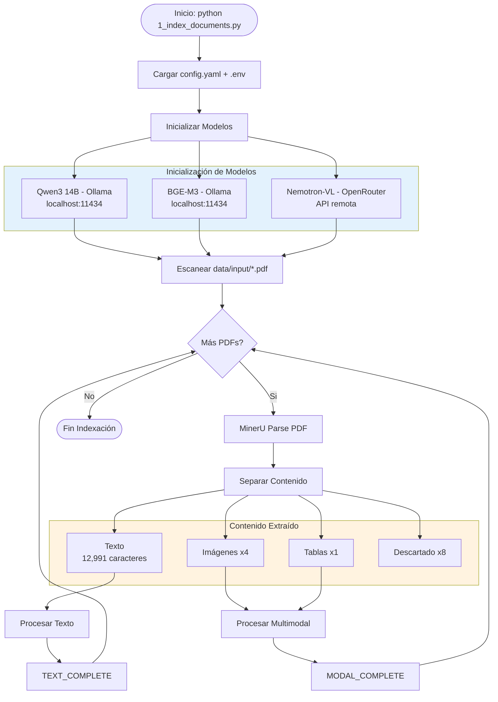
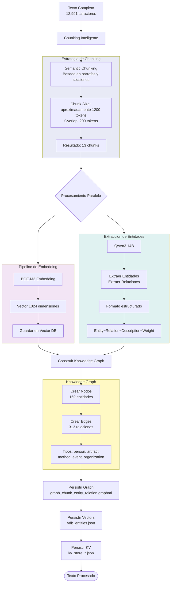
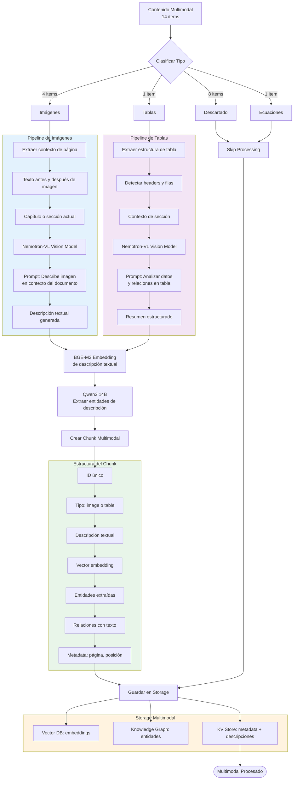

# Fase 1: Indexación de Documentos

## Tabla de Contenidos

1. [Introducción](#introducción)
2. [Visión General del Proceso](#visión-general-del-proceso)
3. [Flujo Completo de Indexación](#flujo-completo-de-indexación)
4. [Procesamiento de Texto](#procesamiento-de-texto)
5. [Procesamiento Multimodal](#procesamiento-multimodal)
6. [Construcción del Knowledge Graph](#construcción-del-knowledge-graph)
7. [Optimizaciones y Consideraciones](#optimizaciones-y-consideraciones)

---

## Introducción

La fase de indexación es el proceso fundamental mediante el cual transformamos documentos PDF crudos en una estructura de datos consultable y semánticamente rica. Este proceso no se limita a extraer texto, sino que construye una representación multidimensional del conocimiento contenido en los documentos.

### Objetivos de la Indexación

El proceso de indexación busca lograr tres objetivos principales:

1. **Extracción estructurada**: Separar y clasificar diferentes tipos de contenido (texto, imágenes, tablas) manteniendo su contexto original
2. **Enriquecimiento semántico**: Extraer entidades, relaciones y conceptos clave del contenido
3. **Representación múltiple**: Crear diferentes vistas del mismo contenido (vectorial, gráfica, textual) para facilitar diversos tipos de búsqueda

### Principios de Diseño

La arquitectura de indexación se basa en varios principios fundamentales:

- **Modularidad**: Cada tipo de contenido tiene su propio pipeline de procesamiento
- **Paralelización**: Los procesos de embedding y extracción de entidades ocurren en paralelo
- **Preservación de contexto**: Se mantiene información sobre la ubicación y relación espacial del contenido original
- **Procesamiento incremental**: Los documentos se procesan de forma independiente, permitiendo actualizaciones

---

## Visión General del Proceso

```mermaid
graph TB
    START([Inicio: Indexación de Documentos])
    
    START --> CONFIG[Cargar Configuración]
    CONFIG --> MODELS[Inicializar Modelos]
    
    subgraph "Modelos del Sistema"
        LLM[Qwen3 14B - Ollama<br/>Extracción de Entidades]
        EMBED[BGE-M3 - Ollama<br/>Generación de Embeddings]
        VISION[Nemotron-VL - OpenRouter<br/>Análisis Visual]
    end
    
    MODELS --> LLM
    MODELS --> EMBED
    MODELS --> VISION
    
    LLM --> SCAN
    EMBED --> SCAN
    VISION --> SCAN
    
    SCAN[Escanear Directorio de PDFs]
    SCAN --> LOOP{Más Documentos?}
    
    LOOP -->|Si| PARSE[Parser MinerU]
    LOOP -->|No| COMPLETE([Indexación Completa])
    
    PARSE --> CLASSIFY[Clasificar Contenido]
    
    subgraph "Tipos de Contenido"
        TEXT[Texto Plano]
        IMAGES[Imágenes]
        TABLES[Tablas]
        EQUATIONS[Ecuaciones]
        DISCARDED[Contenido Descartado]
    end
    
    CLASSIFY --> TEXT
    CLASSIFY --> IMAGES
    CLASSIFY --> TABLES
    CLASSIFY --> EQUATIONS
    CLASSIFY --> DISCARDED
    
    TEXT --> PROCESS_TEXT[Pipeline de Texto]
    IMAGES --> PROCESS_MODAL[Pipeline Multimodal]
    TABLES --> PROCESS_MODAL
    EQUATIONS --> PROCESS_MODAL
    
    PROCESS_TEXT --> STORAGE
    PROCESS_MODAL --> STORAGE
    DISCARDED --> LOOP
    
    STORAGE[Guardar en Storage]
    STORAGE --> LOOP
    
    style "Modelos del Sistema" fill:#E3F2FD
    style "Tipos de Contenido" fill:#FFF3E0
```

### Etapas del Proceso

#### 1. Inicialización del Sistema

El proceso comienza con la inicialización de tres componentes críticos:

**Configuración**: Se cargan los parámetros desde archivos de configuración (config.yaml y variables de entorno). Estos incluyen:
- Rutas de entrada y salida
- Parámetros de chunking (tamaño, overlap)
- Configuración de modelos (URLs, API keys)
- Estrategias de búsqueda y almacenamiento

**Modelos de IA**: Se establecen conexiones con tres modelos especializados:
- Un LLM para razonamiento y extracción de entidades
- Un modelo de embeddings para representación vectorial
- Un modelo de visión para análisis de contenido visual

**Sistema de Storage**: Se preparan las estructuras de datos que almacenarán:
- Knowledge Graph (NetworkX)
- Vector Database (Nano Vector DB)
- Key-Value Store (archivos JSON)

#### 2. Procesamiento por Documento

Cada PDF en el directorio de entrada pasa por un ciclo de procesamiento independiente. Este diseño permite:
- Procesamiento incremental de nuevos documentos
- Recuperación de errores por documento
- Paralelización futura si se requiere

#### 3. Parsing con MinerU

MinerU es el motor de extracción que analiza la estructura del PDF. A diferencia de extractores simples, MinerU:
- Detecta la disposición espacial del contenido
- Identifica tipos de elementos (texto, imagen, tabla)
- Mantiene jerarquía de secciones y capítulos
- Extrae metadata como números de página y posiciones

#### 4. Clasificación de Contenido

El contenido extraído se clasifica en categorías, cada una con su pipeline específico:

**Texto**: Párrafos, secciones, contenido narrativo
**Imágenes**: Diagramas, fotografías, ilustraciones
**Tablas**: Datos estructurados en filas y columnas
**Ecuaciones**: Fórmulas matemáticas
**Descartado**: Elementos sin valor semántico (líneas decorativas, headers repetitivos)

#### 5. Procesamiento Especializado

Cada tipo de contenido entra en su pipeline correspondiente:

- **Pipeline de Texto**: Chunking → Embedding → Extracción de entidades → Graph construction
- **Pipeline Multimodal**: Análisis visual → Generación de descripción → Embedding → Extracción de entidades

#### 6. Almacenamiento Unificado

Los resultados de ambos pipelines convergen en un sistema de storage triple:
- Vectores en Vector DB
- Entidades y relaciones en Knowledge Graph
- Metadata y contenido original en Key-Value Store

---

## Flujo Completo de Indexación



### Detalles de Implementación

#### Carga de Configuración

El sistema lee dos fuentes de configuración:

**config.yaml**: Contiene parámetros estructurales del sistema
```yaml
chunking:
  size: 1200
  overlap: 200
  
models:
  llm: qwen3:14b
  embedding: bge-m3
  vision: nemotron-vl
  
storage:
  path: ./storage/rag_storage/
```

**.env**: Almacena credenciales y URLs sensibles
```
OLLAMA_URL=http://localhost:11434
OPENROUTER_API_KEY=sk-xxxxx
```

#### Inicialización de Modelos

Cada modelo se inicializa con parámetros específicos:

**LLM (Qwen3 14B)**:
- Temperatura: 0.1 (respuestas más deterministas)
- Top-p: 0.9 (diversidad controlada)
- Max tokens: 4096 (respuestas extensas para extracción)

**Embedding (BGE-M3)**:
- Dimensionalidad: 1024
- Normalización: L2 (para cálculo de similitud coseno)
- Batch size: 32 (procesamiento eficiente)

**Vision (Nemotron-VL)**:
- Resolución máxima: 1024x1024
- Formato: JPEG/PNG
- Timeout: 60 segundos por imagen

#### Escaneo de Archivos

El sistema escanea el directorio `data/input/` buscando archivos PDF. Para cada archivo:

1. Verifica si ya fue procesado (consulta doc_status.json)
2. Calcula hash del archivo para detectar cambios
3. Si el documento es nuevo o cambió, lo marca para procesamiento
4. Mantiene un log de procesamiento

---

## Procesamiento de Texto



### Chunking Inteligente

El chunking es el proceso de dividir el texto largo en fragmentos manejables. A diferencia de un simple corte por caracteres, el chunking inteligente considera:

#### Estrategia Semántica

El sistema respeta límites naturales del lenguaje:

**Prioridad de separación**:
1. Separadores de sección (títulos, encabezados)
2. Separadores de párrafo (dobles saltos de línea)
3. Separadores de oración (puntos, signos de interrogación)
4. Separadores de palabra (espacios)

Esta jerarquía asegura que los chunks mantengan coherencia semántica. Un chunk nunca corta en medio de una oración a menos que sea absolutamente necesario.

#### Parámetros de Tamaño

**Chunk Size (1200 tokens)**: 
- Aproximadamente 800-1000 palabras en español
- Suficiente para capturar contexto completo de un concepto
- Pequeño suficiente para embeddings precisos
- Balance entre granularidad y contexto

**Overlap (200 tokens)**:
- Los chunks comparten 200 tokens con sus vecinos
- Previene pérdida de información en los límites
- Permite que conceptos que cruzan límites de chunk se preserven
- Facilita la continuidad contextual

#### Ejemplo de Chunking

Consideremos un texto sobre DeepSeek-OCR:

```
Chunk 1 (tokens 1-1200):
"DeepSeek-OCR: All-in-One Document Parsing Model
Introduction
Document parsing involves extracting...
[...contenido...]
The model architecture consists of three main components..."

Chunk 2 (tokens 1001-2200):  # Overlap desde token 1001
"...three main components: the encoder, decoder, and attention mechanism.
Encoder Architecture
The encoder utilizes a transformer-based design..."
```

Nótese cómo el overlap permite que la mención de "three main components" aparezca en ambos chunks, preservando el contexto.

### Procesamiento Paralelo

Una vez dividido el texto, cada chunk entra en dos pipelines simultáneos:

#### Pipeline de Embedding

**Objetivo**: Convertir el texto en una representación vectorial numérica

**Proceso**:
1. El chunk se envía al modelo BGE-M3
2. El modelo genera un vector de 1024 dimensiones
3. El vector se normaliza (norma L2)
4. Se almacena en el Vector DB con metadata

**Propiedades del vector**:
- Captura el significado semántico del texto
- Chunks con significados similares tendrán vectores cercanos en el espacio
- Permite búsqueda por similitud mediante distancia coseno

**Ejemplo conceptual**:
```
Texto: "El modelo utiliza transformers para procesar texto"
Vector: [0.023, -0.145, 0.892, ..., 0.234]  # 1024 dimensiones

Texto similar: "Transformers se usan para analizar lenguaje"
Vector: [0.019, -0.138, 0.901, ..., 0.228]  # Vector cercano

Texto diferente: "La receta requiere harina y huevos"
Vector: [-0.421, 0.532, -0.123, ..., 0.891]  # Vector distante
```

#### Pipeline de Extracción de Entidades

**Objetivo**: Identificar conceptos clave y sus relaciones en el texto

**Prompt al LLM**:
```
Analiza el siguiente texto y extrae:
1. Entidades: nombres de personas, organizaciones, métodos, artefactos, eventos
2. Relaciones: cómo se conectan estas entidades entre sí
3. Descripciones: breve explicación de cada entidad

Formato de salida:
Entity~Relation~Target~Description~Weight
```

**Ejemplo de extracción**:

Texto input:
```
"DeepSeek-OCR utiliza el modelo SAM-base para la segmentación de documentos.
Este método fue evaluado en el dataset FUNSD."
```

Output del LLM:
```
DeepSeek-OCR~uses~SAM-base~OCR model using SAM for segmentation~8
SAM-base~evaluated-on~FUNSD~Base model tested on FUNSD dataset~7
FUNSD~is-a~dataset~Form understanding dataset~6
DeepSeek-OCR~evaluated-on~FUNSD~OCR method tested on forms~9
```

**Componentes de cada entrada**:
- **Entity**: Nombre de la entidad principal
- **Relation**: Tipo de relación (uses, evaluated-on, part-of, etc.)
- **Target**: Entidad relacionada
- **Description**: Explicación del contexto
- **Weight**: Importancia de la relación (1-10)

### Construcción del Knowledge Graph

Los resultados de la extracción de entidades se utilizan para construir un grafo de conocimiento:

#### Creación de Nodos

Cada entidad única se convierte en un nodo del grafo:

**Atributos del nodo**:
- ID único (nombre de la entidad)
- Tipo (person, artifact, method, event, organization)
- Descripción (extraída del LLM)
- Source chunk (ID del chunk origen)
- Source document (archivo PDF origen)

**Tipos de entidades**:

- **Person**: Autores, investigadores, figuras mencionadas
- **Artifact**: Modelos, herramientas, datasets, papers
- **Method**: Técnicas, algoritmos, procedimientos
- **Event**: Benchmarks, evaluaciones, experimentos
- **Organization**: Instituciones, empresas, laboratorios

#### Creación de Edges

Las relaciones extraídas se convierten en aristas del grafo:

**Atributos del edge**:
- Source node (entidad origen)
- Target node (entidad destino)
- Relation type (tipo de relación)
- Weight (peso de la relación)
- Description (contexto de la relación)
- Source chunk (de dónde se extrajo)

**Tipos de relaciones**:

- **uses**: Una entidad utiliza otra
- **part-of**: Componente de un sistema mayor
- **evaluated-on**: Método probado en dataset
- **compared-with**: Comparación entre métodos
- **belongs-to**: Pertenencia organizacional
- **authored-by**: Autoría de trabajo
- **improves**: Mejora sobre trabajo previo

#### Ejemplo de Subgrafo

```
[DeepSeek-OCR] --uses--> [SAM-base]
[DeepSeek-OCR] --evaluated-on--> [FUNSD]
[SAM-base] --part-of--> [DeepSeek-OCR]
[FUNSD] --is-a--> [Dataset]
[DeepSeek-OCR] --authored-by--> [DeepSeek Team]
[DeepSeek Team] --belongs-to--> [DeepSeek]
```

Este subgrafo permite responder preguntas como:
- "¿Qué modelos usa DeepSeek-OCR?" → SAM-base
- "¿En qué datasets fue evaluado?" → FUNSD
- "¿Quién desarrolló DeepSeek-OCR?" → DeepSeek Team

### Almacenamiento de Datos de Texto

Los datos procesados se guardan en tres sistemas:

#### Vector Database

Archivo: `vdb_chunks.json`

Estructura:
```json
{
  "chunk-abc123": {
    "embedding": [0.023, -0.145, ..., 0.234],
    "metadata": {
      "doc_id": "doc-xyz789",
      "chunk_order": 1,
      "tokens": 487,
      "source": "deepseek-ocr-paper.pdf"
    }
  }
}
```

Propósito: Búsqueda rápida por similitud semántica

#### Knowledge Graph

Archivo: `graph_chunk_entity_relation.graphml`

Formato: GraphML (XML para grafos)
```xml
<node id="DeepSeek-OCR">
  <data key="type">artifact</data>
  <data key="description">OCR model...</data>
</node>
<edge source="DeepSeek-OCR" target="SAM-base">
  <data key="relation">uses</data>
  <data key="weight">8</data>
</edge>
```

Propósito: Navegación de relaciones semánticas, consultas de grafos

#### Key-Value Store

Archivo: `kv_store_text_chunks.json`

Estructura:
```json
{
  "chunk-abc123": {
    "content": "DeepSeek-OCR: All-in-One Document...",
    "doc_id": "doc-xyz789",
    "file_path": "deepseek-ocr-paper.pdf",
    "chunk_order": 1,
    "tokens": 487,
    "created_at": 1763128318
  }
}
```

Propósito: Recuperar contenido original completo para contexto del LLM

---

## Procesamiento Multimodal



### Clasificación de Contenido Visual

El parser MinerU identifica elementos no textuales en el PDF. Cada elemento se clasifica según su naturaleza:

#### Tipos de Contenido Visual

**Imágenes**:
- Diagramas de arquitectura
- Gráficos de resultados
- Fotografías ilustrativas
- Capturas de pantalla
- Flujos de proceso visuales

**Tablas**:
- Datos estructurados en filas y columnas
- Resultados de experimentos
- Comparaciones de métodos
- Especificaciones técnicas

**Ecuaciones**:
- Fórmulas matemáticas
- Expresiones simbólicas
- Notación científica

**Contenido Descartado**:
- Líneas decorativas
- Espacios en blanco excesivos
- Headers/footers repetitivos
- Marcas de agua

### Pipeline de Imágenes

El procesamiento de imágenes transforma contenido visual en texto descriptivo que puede ser indexado y buscado.

#### Extracción de Contexto

Antes de analizar la imagen, se recolecta información contextual:

**Contexto espacial**:
- Número de página donde aparece
- Posición en la página (top, middle, bottom)
- Elementos antes y después de la imagen

**Contexto semántico**:
- Título o caption de la imagen (si existe)
- Párrafo inmediatamente anterior
- Párrafo inmediatamente posterior
- Sección o capítulo actual

**Ejemplo de contexto extraído**:
```
Página: 3
Sección: "Architecture Design"
Texto anterior: "The model consists of three main components..."
Caption: "Figure 2: DeepEncoder Architecture"
Texto posterior: "As shown in the figure, the encoder processes..."
```

#### Análisis con Vision Model

La imagen junto con su contexto se envía al modelo de visión Nemotron-VL.

**Prompt al modelo**:
```
You are analyzing an image from a technical document about [TEMA_DOCUMENTO].

Context from document:
- Section: [SECCION]
- Text before: [TEXTO_ANTERIOR]
- Caption: [CAPTION]
- Text after: [TEXTO_POSTERIOR]

Please describe this image in detail, explaining:
1. What visual elements are present
2. How the image relates to the surrounding text
3. What technical concepts it illustrates
4. Any data or information shown

Be specific and technical in your description.
```

**Ejemplo de respuesta del modelo**:

Input: Diagrama de arquitectura de DeepEncoder

Output:
```
The image shows a multi-layer neural network architecture diagram. 
At the base is a SAM-base encoder layer, followed by a CLIP-large 
vision transformer. The architecture includes three attention layers 
that process visual features. Arrows indicate the flow of information 
from input images through the encoder to the final embedding space. 
The diagram illustrates the hierarchical processing structure where 
lower layers extract basic features and upper layers learn semantic 
representations. This architecture is referenced in the surrounding 
text as the core component of the DeepEncoder system.
```

#### Generación de Embedding

La descripción textual generada por el vision model se procesa como texto normal:

1. Se envía a BGE-M3 para generar embedding
2. El vector de 1024 dimensiones se almacena en Vector DB
3. Se asocia con metadata de la imagen original

Esto permite que las búsquedas textuales encuentren imágenes relevantes basándose en su contenido visual descrito.

### Pipeline de Tablas

Las tablas contienen datos estructurados que requieren análisis especializado.

#### Extracción de Estructura

El parser identifica la estructura de la tabla:

**Componentes detectados**:
- Headers de columnas
- Headers de filas (si existen)
- Celdas de datos
- Footnotes o notas
- Caption o título

**Ejemplo de tabla extraída**:

```
Table 1: Performance Comparison

| Model          | Accuracy | F1-Score | Speed (ms) |
|----------------|----------|----------|------------|
| DeepSeek-OCR   | 95.2%    | 0.94     | 45         |
| Tesseract      | 87.3%    | 0.85     | 120        |
| EasyOCR        | 89.1%    | 0.88     | 80         |
```

#### Análisis con Vision Model

La tabla se analiza considerando su contexto:

**Prompt al modelo**:
```
You are analyzing a table from a technical document.

Table caption: [CAPTION]
Context: [CONTEXTO_SECCION]

The table contains the following structure:
Headers: [HEADERS]
Data: [PRIMERAS_FILAS]

Please analyze this table and describe:
1. What data is being presented
2. What comparisons or relationships are shown
3. Key findings or patterns in the data
4. How this relates to the document's main topic

Provide a structured summary that captures the essential information.
```

**Ejemplo de respuesta**:

```
This table presents a performance comparison of three OCR models 
across three metrics: accuracy, F1-score, and processing speed. 
DeepSeek-OCR demonstrates the highest accuracy (95.2%) and best 
F1-score (0.94), while also being the fastest with 45ms processing 
time. Tesseract shows lower performance (87.3% accuracy) and is 
significantly slower at 120ms. EasyOCR falls in between with 89.1% 
accuracy and 80ms speed. The data suggests DeepSeek-OCR achieves 
superior performance across all measured dimensions, supporting the 
paper's claim of state-of-the-art results.
```

### Creación de Chunks Multimodales

Los elementos visuales procesados se convierten en chunks estructurados:

#### Estructura del Chunk Multimodal

```json
{
  "id": "chunk-image-abc123",
  "type": "image",
  "content": {
    "description": "The image shows a multi-layer neural network...",
    "caption": "Figure 2: DeepEncoder Architecture",
    "page": 3,
    "position": "middle",
    "context_before": "The model consists of three...",
    "context_after": "As shown in the figure..."
  },
  "embedding": [0.123, -0.456, ..., 0.789],
  "entities": [
    {"name": "DeepEncoder", "type": "artifact"},
    {"name": "SAM-base", "type": "method"},
    {"name": "CLIP-large", "type": "artifact"}
  ],
  "metadata": {
    "source_doc": "deepseek-ocr-paper.pdf",
    "created_at": 1763128318,
    "vision_model": "nemotron-vl"
  }
}
```

#### Integración con Knowledge Graph

Las entidades extraídas de descripciones visuales se añaden al grafo:

**Nodos de imágenes**:
- Se crean nodos especiales tipo "visual_content"
- Se vinculan con entidades mencionadas en su descripción
- Se relacionan con el chunk de texto más cercano

**Ejemplo de relaciones**:
```
[Figure 2] --illustrates--> [DeepEncoder]
[DeepEncoder] --uses--> [SAM-base]
[Figure 2] --located-in--> [Section 3.2]
[Text Chunk 5] --describes--> [Figure 2]
```

Esto permite:
- Encontrar imágenes que ilustran un concepto
- Ver qué conceptos están representados visualmente
- Navegar entre texto e imágenes relacionadas

---

## Construcción del Knowledge Graph

### Propósito del Knowledge Graph

El grafo de conocimiento es una representación estructurada de las entidades y sus relaciones encontradas en los documentos. A diferencia de la búsqueda vectorial que encuentra similitudes semánticas difusas, el grafo permite:

- Navegación explícita de relaciones
- Consultas de caminos (¿cómo se relaciona A con B?)
- Análisis de centralidad (¿qué conceptos son más importantes?)
- Descubrimiento de patrones de conexión

### Construcción Incremental

El grafo se construye de forma incremental a medida que se procesan los chunks:

#### Proceso de Adición

Para cada chunk procesado:

1. **Extraer entidades y relaciones** del output del LLM
2. **Verificar existencia** de entidades en el grafo
   - Si la entidad existe: actualizar su descripción si la nueva es más completa
   - Si no existe: crear nuevo nodo
3. **Crear relaciones** entre entidades
   - Verificar si la relación ya existe
   - Si existe: incrementar su peso
   - Si no existe: crear nuevo edge
4. **Añadir metadata** de trazabilidad
   - Chunk origen
   - Documento origen
   - Timestamp

#### Deduplicación de Entidades

El sistema maneja menciones múltiples de la misma entidad:

**Normalización de nombres**:
- "DeepSeek OCR" y "DeepSeek-OCR" → "DeepSeek-OCR"
- "SAM base model" y "SAM-base" → "SAM-base"

**Resolución de sinónimos** (simple):
- Se considera que nombres muy similares (>90% similitud) son la misma entidad
- El nombre más frecuente se convierte en canónico

**Fusión de descripciones**:
```
Mención 1: "DeepSeek-OCR is an OCR model"
Mención 2: "DeepSeek-OCR uses transformers for document parsing"

Descripción fusionada: "DeepSeek-OCR is an OCR model that uses 
transformers for document parsing"
```

### Tipos de Consultas Soportadas

El grafo permite diferentes tipos de consultas:

#### Consultas de Vecindad

"¿Qué entidades están directamente relacionadas con X?"

```
Query: Vecinos de "DeepSeek-OCR"
Resultado:
  - SAM-base (uses)
  - FUNSD (evaluated-on)
  - Tesseract (compared-with)
  - DeepSeek Team (authored-by)
```

#### Consultas de Camino

"¿Cómo se relaciona X con Y?"

```
Query: Camino entre "DeepSeek-OCR" y "FUNSD"
Resultado: DeepSeek-OCR --evaluated-on--> FUNSD
```

```
Query: Camino entre "DeepSeek-OCR" y "Transformer Architecture"
Resultado: 
DeepSeek-OCR --uses--> SAM-base --based-on--> Transformer Architecture
```

#### Consultas de Subgrafo

"¿Qué métodos fueron evaluados en FUNSD?"

```
Query: Nodos X donde X --evaluated-on--> FUNSD
Resultado:
  - DeepSeek-OCR
  - LayoutLM
  - Tesseract
```

### Métricas del Grafo

El sistema calcula métricas para entender la estructura del conocimiento:

#### Centralidad de Nodos

Identifica conceptos más importantes:

**Degree Centrality**: Número de conexiones
```
DeepSeek-OCR: 15 conexiones (concepto central)
FUNSD: 8 conexiones (dataset importante)
SAM-base: 12 conexiones (método clave)
```

**Betweenness Centrality**: Qué tan frecuentemente un nodo aparece en caminos entre otros nodos
```
Transformer Architecture: Alta betweenness (concepto puente)
```

#### Análisis de Comunidades

Detecta grupos de conceptos fuertemente conectados:

```
Comunidad 1: Arquitecturas de modelos
  - DeepSeek-OCR, SAM-base, CLIP-large, Transformer

Comunidad 2: Evaluación y Benchmarks  
  - FUNSD, CORD, RVL-CDIP, Accuracy, F1-Score

Comunidad 3: Técnicas de procesamiento
  - OCR, Document Parsing, Text Detection, Layout Analysis
```

---

## Optimizaciones y Consideraciones

### Gestión de Memoria

El procesamiento de documentos grandes requiere manejo cuidadoso de memoria:

#### Procesamiento por Chunks

En lugar de cargar documentos completos en memoria:
- Se procesan chunks individualmente
- Cada chunk se libera de memoria después de ser procesado
- Los vectores y entidades se escriben a disco inmediatamente

#### Batch Processing

Para operaciones de embedding:
- Se agrupan múltiples chunks en batches
- Batch size típico: 32 chunks
- Reduce overhead de llamadas al modelo
- Balance entre memoria y eficiencia

### Manejo de Errores

El sistema implementa recuperación de errores:

#### Errores de Parsing

Si MinerU falla al parsear un documento:
- Se registra el error en logs
- Se marca el documento como "failed" en doc_status.json
- Se continúa con el siguiente documento
- Se puede reintentar manualmente

#### Errores de Modelo

Si un modelo (LLM, embedding, vision) no responde:
- Retry con backoff exponencial (3 intentos)
- Si falla persistentemente: skip ese chunk
- Se registra qué chunks no se procesaron
- Se pueden reprocesar posteriormente

#### Validación de Salidas

El sistema valida que las salidas del LLM sean correctas:

```python
def validate_entity_output(output: str) -> bool:
    lines = output.strip().split('\n')
    for line in lines:
        parts = line.split('~')
        if len(parts) != 5:  # Entity~Relation~Target~Description~Weight
            return False
        if not parts[4].isdigit():  # Weight debe ser número
            return False
    return True
```

Si la salida no es válida:
- Se reintenta con prompt más específico
- Se registra el problema
- Como último recurso, se skip ese chunk

### Performance

#### Tiempos de Procesamiento

Para un documento de 10 páginas típico:

```
MinerU parsing: ~5 segundos
Chunking: <1 segundo
Embedding (13 chunks): ~8 segundos (0.6s por chunk)
Entity extraction (13 chunks): ~65 segundos (5s por chunk)
Vision processing (5 imágenes): ~30 segundos (6s por imagen)
Graph construction: ~2 segundos
Total: ~110 segundos
```

#### Cuellos de Botella

Los procesos más lentos son:

1. **Entity extraction por LLM**: 5 segundos por chunk
   - El LLM debe analizar texto y generar respuesta estructurada
   - Mitigación: usar modelo más pequeño o batch processing

2. **Vision model processing**: 6 segundos por imagen
   - Llamadas a API remota
   - Mitigación: procesamiento paralelo de múltiples imágenes

3. **MinerU parsing**: 5 segundos por documento
   - Análisis complejo de estructura PDF
   - Mitigación: inevitable, pero se hace una sola vez por documento

#### Paralelización Futura

Oportunidades de optimización:

- Procesar múltiples chunks en paralelo (actualmente secuencial)
- Procesar múltiples documentos en paralelo
- Batch embedding de todos los chunks a la vez
- Caché de embeddings para texto repetido

### Escalabilidad

#### Límites Actuales

Con la implementación actual:

- Hasta ~100 documentos: sin problemas
- 100-1000 documentos: inicio de degradación de performance
- 1000+ documentos: necesita optimizaciones

#### Bottlenecks de Escalabilidad

**Tamaño del grafo**:
- NetworkX mantiene todo en memoria
- Grafos con >100,000 nodos pueden ser problemáticos
- Solución: usar base de datos de grafos (Neo4j)

**Vector DB**:
- Nano Vector DB carga todos los vectores en memoria
- Con >10,000 vectores puede ser lento
- Solución: usar vector DB especializado (Pinecone, Weaviate)

**Storage en JSON**:
- Archivos JSON grandes son lentos de leer/escribir
- Solución: usar base de datos apropiada (PostgreSQL)

### Calidad de Extracción

#### Factores que Afectan Calidad

**Claridad del texto**:
- Textos académicos bien escritos: alta calidad de extracción
- Textos coloquiales o mal formateados: menor calidad

**Prompt engineering**:
- Prompts claros y específicos mejoran resultados
- Ejemplos en el prompt aumentan consistencia

**Temperatura del modelo**:
- Temperatura baja (0.1): más determinista, mejor para extracción
- Temperatura alta: más creativo, peor para estructuras

#### Métricas de Calidad

Para evaluar la calidad de indexación:

**Cobertura**:
- ¿Cuántas entidades importantes se extrajeron?
- Comparar contra anotación manual

**Precisión**:
- ¿Las entidades extraídas son correctas?
- ¿Las relaciones son válidas?

**Consistencia**:
- ¿La misma entidad mencionada múltiples veces se detecta como una sola?

---

## Resumen

La fase de indexación transforma documentos PDF crudos en una representación rica y consultable mediante:

1. **Parsing inteligente** que respeta la estructura del documento
2. **Chunking semántico** que preserva coherencia y contexto
3. **Procesamiento dual** (embedding + entidades) de contenido textual
4. **Análisis visual** que convierte imágenes y tablas en texto descriptivo
5. **Construcción de grafo** que captura relaciones semánticas explícitas
6. **Almacenamiento triple** que permite múltiples estrategias de búsqueda

El resultado es un sistema que no solo indexa texto, sino que comprende la estructura semántica del conocimiento contenido en los documentos.
