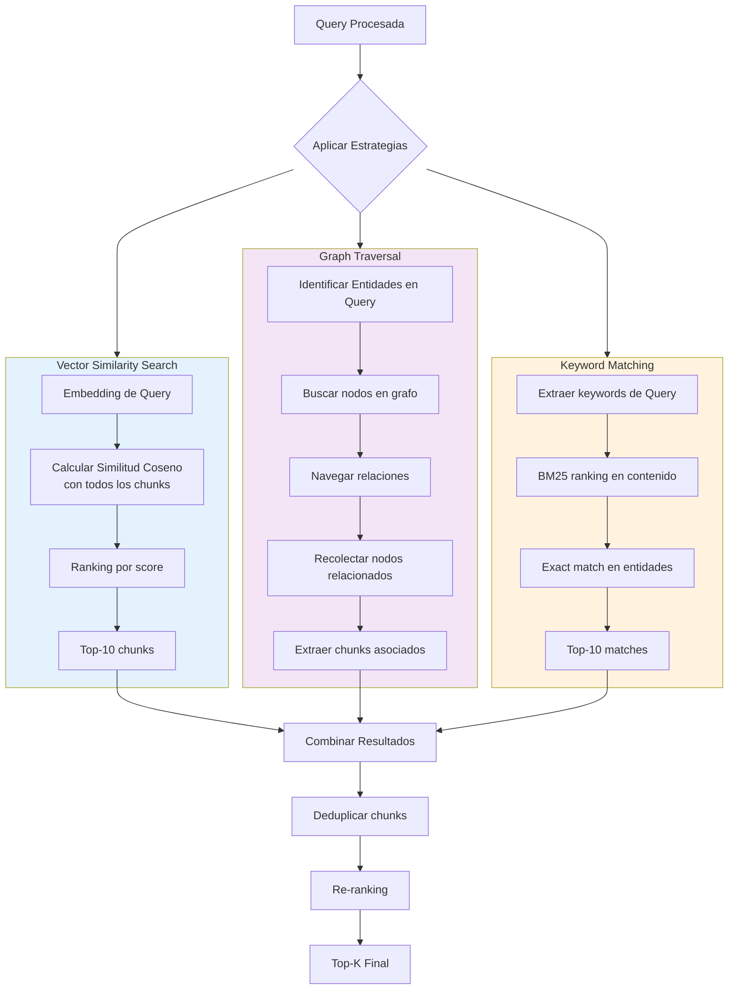
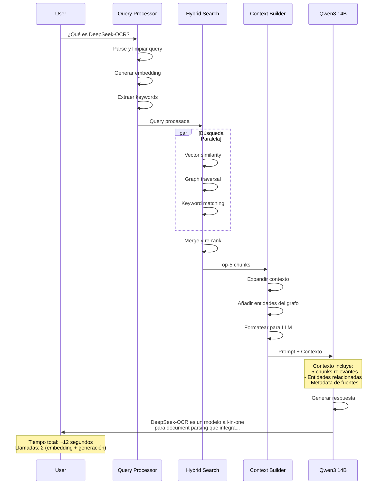

# Fase 2: Query y Retrieval

## Tabla de Contenidos

1. [Introducción](#introducción)
2. [Arquitectura de Búsqueda](#arquitectura-de-búsqueda)
3. [Procesamiento de Queries](#procesamiento-de-queries)
4. [Estrategias de Retrieval](#estrategias-de-retrieval)
5. [Hybrid Search](#hybrid-search)
6. [Generación de Respuestas](#generación-de-respuestas)
7. [Optimización y Ranking](#optimización-y-ranking)

---

## Introducción

La fase de query y retrieval es el proceso mediante el cual el sistema responde a preguntas del usuario utilizando el conocimiento indexado previamente. Esta fase convierte la pregunta en una consulta estructurada, busca información relevante en múltiples fuentes, y sintetiza una respuesta coherente.

### Objetivos del Sistema de Retrieval

El sistema de recuperación busca lograr tres objetivos fundamentales:

1. **Relevancia**: Encontrar la información más pertinente para responder la pregunta del usuario
2. **Completitud**: Reunir suficiente contexto para generar una respuesta completa
3. **Eficiencia**: Realizar la búsqueda y generación de respuesta en tiempo razonable

### Diferencias con Búsqueda Tradicional

A diferencia de un buscador web tradicional que retorna documentos, este sistema:

- **Comprende semántica**: No solo busca palabras clave, sino significados
- **Navega relaciones**: Utiliza el grafo de conocimiento para encontrar información conectada
- **Sintetiza respuestas**: Genera una respuesta natural en lugar de listar resultados
- **Mantiene contexto**: Utiliza información de múltiples fuentes coherentemente

### Principios de Diseño

La arquitectura de retrieval se fundamenta en varios principios:

- **Búsqueda híbrida**: Combina múltiples estrategias para mejor cobertura
- **Re-ranking**: Refina los resultados para priorizar la información más relevante
- **Contexto rico**: Proporciona al LLM generador suficiente información de fondo
- **Trazabilidad**: Mantiene referencias a las fuentes de información

---

## Arquitectura de Búsqueda

```mermaid
graph TB
    USER[Usuario]
    USER --> QUERY[Query Input]
    
    QUERY --> PROCESS[Procesamiento de Query]
    
    subgraph "Análisis de Query"
        PARSE[Parse Query]
        CLASSIFY[Clasificar Tipo]
        EXPAND[Expandir Términos]
    end
    
    PROCESS --> PARSE
    PARSE --> CLASSIFY
    CLASSIFY --> EXPAND
    
    EXPAND --> SEARCH[Motor de Búsqueda Híbrido]
    
    subgraph "Estrategias de Búsqueda"
        VECTOR[Vector Similarity Search]
        GRAPH[Graph Traversal]
        KEYWORD[Keyword Matching]
    end
    
    SEARCH --> VECTOR
    SEARCH --> GRAPH
    SEARCH --> KEYWORD
    
    VECTOR --> MERGE[Merge y Re-rank]
    GRAPH --> MERGE
    KEYWORD --> MERGE
    
    MERGE --> CONTEXT[Construcción de Contexto]
    
    subgraph "Contexto para LLM"
        CHUNKS[Chunks Relevantes]
        ENTITIES[Entidades Relacionadas]
        METADATA[Metadata y Referencias]
    end
    
    CONTEXT --> CHUNKS
    CONTEXT --> ENTITIES
    CONTEXT --> METADATA
    
    CHUNKS --> GENERATE[Generación de Respuesta]
    ENTITIES --> GENERATE
    METADATA --> GENERATE
    
    GENERATE --> LLM[Qwen3 14B]
    LLM --> ANSWER[Respuesta Final]
    ANSWER --> USER
    
    style "Análisis de Query" fill:#E3F2FD
    style "Estrategias de Búsqueda" fill:#F3E5F5
    style "Contexto para LLM" fill:#E8F5E9
```

### Componentes del Sistema

#### Motor de Búsqueda

El motor de búsqueda orquesta tres estrategias complementarias:

**Vector Similarity Search**:
- Busca chunks con embeddings similares al embedding de la query
- Captura similitud semántica difusa
- Bueno para preguntas conceptuales amplias

**Graph Traversal**:
- Navega el grafo de conocimiento buscando entidades y relaciones
- Captura conexiones explícitas
- Bueno para preguntas sobre relaciones entre conceptos

**Keyword Matching**:
- Búsqueda exacta de términos en el contenido
- Captura menciones específicas
- Bueno para nombres propios y términos técnicos

#### Sistema de Ranking

El sistema de ranking ordena y filtra resultados:

1. **Scoring inicial**: Cada estrategia asigna scores a sus resultados
2. **Normalización**: Los scores se normalizan a un rango común (0-1)
3. **Fusión**: Los resultados de las tres estrategias se combinan
4. **Re-ranking**: Se aplican heurísticas adicionales para refinar el orden

#### Constructor de Contexto

El constructor de contexto prepara la información para el LLM:

1. **Selección**: Escoge los top-k chunks más relevantes
2. **Expansión**: Añade chunks vecinos para contexto adicional
3. **Enriquecimiento**: Añade entidades y relaciones del grafo
4. **Formateo**: Estructura la información en un formato óptimo para el LLM

---

## Procesamiento de Queries

```mermaid
flowchart TD
    RAW_QUERY[Query Cruda del Usuario]
    
    RAW_QUERY --> PARSE[Parsing de Query]
    
    subgraph "Análisis de Query"
        TOKENIZE[Tokenización]
        CLEAN[Limpieza: stopwords, puntuación]
        NORMALIZE[Normalización: lowercase, stemming]
    end
    
    PARSE --> TOKENIZE
    TOKENIZE --> CLEAN
    CLEAN --> NORMALIZE
    
    NORMALIZE --> CLASSIFY{Clasificar Tipo de Query}
    
    CLASSIFY -->|Factual| FACT[Query Factual]
    CLASSIFY -->|Comparison| COMP[Query Comparativa]
    CLASSIFY -->|Explanation| EXPL[Query Explicativa]
    CLASSIFY -->|Procedural| PROC[Query Procedimental]
    
    FACT --> EXPAND
    COMP --> EXPAND
    EXPL --> EXPAND
    PROC --> EXPAND
    
    EXPAND[Expansión de Query]
    
    subgraph "Expansión de Términos"
        SYNONYMS[Añadir Sinónimos]
        RELATED[Añadir Términos Relacionados]
        ENTITY[Detectar Entidades Nombradas]
    end
    
    EXPAND --> SYNONYMS
    SYNONYMS --> RELATED
    RELATED --> ENTITY
    
    ENTITY --> EMBED[Generar Embedding de Query]
    EMBED --> BGE[BGE-M3 Model]
    BGE --> VECTOR_QUERY[Vector Query 1024-dim]
    
    VECTOR_QUERY --> KEYWORDS[Extraer Keywords Clave]
    
    subgraph "Extracción de Keywords"
        TFIDF[TF-IDF Scoring]
        IMPORTANCE[Importancia Semántica]
        FINAL_KW[Keywords Finales]
    end
    
    KEYWORDS --> TFIDF
    TFIDF --> IMPORTANCE
    IMPORTANCE --> FINAL_KW
    
    FINAL_KW --> READY[Query Procesada]
    VECTOR_QUERY --> READY
    
    READY --> SEARCH[Inicio de Búsqueda]
    
    style "Análisis de Query" fill:#E8EAF6
    style "Expansión de Términos" fill:#F3E5F5
    style "Extracción de Keywords" fill:#E0F2F1
```

### Parsing y Limpieza

El primer paso es limpiar y normalizar la query del usuario.

#### Tokenización

La query se divide en tokens (palabras individuales):

```
Query: "¿Cómo funciona DeepSeek-OCR?"
Tokens: ["Cómo", "funciona", "DeepSeek", "-", "OCR", "?"]
```

#### Limpieza

Se eliminan elementos que no aportan significado semántico:

**Stopwords**: Palabras muy comunes sin valor semántico
```
Stopwords en español: ["el", "la", "de", "que", "y", "a", "en", ...]
Stopwords en inglés: ["the", "a", "an", "in", "on", "at", ...]

Query: "¿Cómo funciona DeepSeek-OCR?"
Después de eliminar stopwords: ["funciona", "DeepSeek-OCR"]
```

**Puntuación**: Se elimina excepto en casos especiales
```
Se mantiene: "DeepSeek-OCR" (guion significativo)
Se elimina: "?" "¡" "," "."
```

#### Normalización

Los términos se normalizan para mejorar matching:

**Lowercase**: Todo a minúsculas (excepto nombres propios detectados)
```
"DeepSeek-OCR" → "deepseek-ocr" (para matching)
Pero se preserva "DeepSeek-OCR" para búsqueda exacta
```

**Stemming** (opcional): Reducir palabras a su raíz
```
"funcionando" → "funcion"
"arquitecturas" → "arquitectur"
"evaluado" → "evalu"
```

### Clasificación de Tipos de Query

El sistema identifica qué tipo de pregunta está haciendo el usuario para optimizar la estrategia de búsqueda.

#### Tipos de Queries

**Query Factual**: Busca un dato específico
```
Ejemplos:
- "¿Qué es DeepSeek-OCR?"
- "¿Cuándo fue publicado el paper?"
- "¿Quién desarrolló SAM-base?"

Características:
- Respuesta corta y específica
- Palabras clave: qué, quién, cuándo, dónde
- Estrategia óptima: Keyword + Entity lookup en grafo
```

**Query Comparativa**: Compara dos o más elementos
```
Ejemplos:
- "¿Cuál es mejor, DeepSeek-OCR o Tesseract?"
- "Diferencias entre SAM-base y CLIP-large"
- "Compara los resultados en FUNSD"

Características:
- Busca múltiples entidades
- Palabras clave: mejor, diferencia, compara, versus
- Estrategia óptima: Entity lookup + Related chunks
```

**Query Explicativa**: Requiere explicación detallada
```
Ejemplos:
- "¿Cómo funciona la arquitectura de DeepSeek-OCR?"
- "Explica el proceso de document parsing"
- "¿Por qué DeepSeek-OCR es efectivo?"

Características:
- Respuesta extensa con detalles
- Palabras clave: cómo, por qué, explica
- Estrategia óptima: Vector similarity + Context expansion
```

**Query Procedimental**: Busca pasos o procedimientos
```
Ejemplos:
- "¿Cómo se entrena el modelo?"
- "Pasos para implementar DeepSeek-OCR"
- "¿Cómo se evalúa en FUNSD?"

Características:
- Respuesta estructurada en pasos
- Palabras clave: cómo, pasos, proceso
- Estrategia óptima: Sequential chunks + Procedure detection
```

### Expansión de Query

La query se expande con términos relacionados para mejorar el recall (recuperar más información relevante).

#### Sinónimos

Se añaden sinónimos de los términos clave:

```
Query: "arquitectura del modelo"

Sinónimos añadidos:
- arquitectura → estructura, diseño, configuración
- modelo → red, sistema, método

Query expandida: 
"arquitectura estructura diseño modelo red sistema"
```

#### Términos Relacionados

Se añaden términos semánticamente relacionados usando el grafo de conocimiento:

```
Query: "DeepSeek-OCR"

Del grafo se extraen términos relacionados:
- SAM-base (connected by "uses")
- Document parsing (connected by "method-for")
- OCR (connected by "is-a")

Query expandida:
"DeepSeek-OCR SAM-base document-parsing OCR"
```

#### Detección de Entidades Nombradas

Se identifican nombres propios en la query:

```
Query: "¿Qué datasets usó DeepSeek-OCR?"

Entidades detectadas:
- DeepSeek-OCR (artifact)
- Dataset (concept)

Estas entidades se marcan para búsqueda exacta en el grafo
```

### Generación de Embedding

La query procesada se convierte en un vector para búsqueda semántica:

```
Query procesada: "arquitectura deepseek-ocr sam-base"
↓
BGE-M3 Embedding Model
↓
Vector [1024-dim]: [0.234, -0.123, 0.456, ..., 0.789]
```

Este vector se usará para calcular similitud con los vectores de los chunks indexados.

### Extracción de Keywords

Se identifican los términos más importantes de la query:

#### TF-IDF Scoring

Se calcula la importancia de cada término:

```
Term Frequency: frecuencia en la query
Inverse Document Frequency: qué tan raro es el término en el corpus

Ejemplo:
- "deepseek-ocr" → TF=1, IDF=alto (término raro) → Score alto
- "modelo" → TF=1, IDF=bajo (término común) → Score bajo
```

#### Importancia Semántica

Se priorizan ciertos tipos de términos:

1. **Nombres propios** (score +0.5): DeepSeek-OCR, FUNSD, SAM-base
2. **Términos técnicos** (score +0.3): arquitectura, transformer, embedding
3. **Verbos de acción** (score +0.2): evaluar, comparar, entrenar
4. **Términos comunes** (score +0.0): modelo, sistema, método

#### Keywords Finales

```
Query: "¿Cómo se evalúa DeepSeek-OCR en FUNSD?"

Keywords extraídos (ordenados por importancia):
1. DeepSeek-OCR (score: 0.95)
2. FUNSD (score: 0.92)
3. evalúa (score: 0.65)
4. cómo (score: 0.30)
```

---

## Estrategias de Retrieval



### Vector Similarity Search

La búsqueda vectorial encuentra chunks semánticamente similares a la query.

#### Cálculo de Similitud Coseno

Para cada chunk en el Vector DB:

```
Similitud = cos(θ) = (query_vector · chunk_vector) / (||query_vector|| × ||chunk_vector||)

Donde:
- query_vector: embedding de la query
- chunk_vector: embedding del chunk indexado
- · : producto punto
- || ||: norma L2
```

**Interpretación del score**:
```
1.0 = Idénticos (máxima similitud)
0.8-0.9 = Muy similar
0.6-0.7 = Similar
0.4-0.5 = Algo similar
<0.4 = No similar
```

#### Ejemplo Práctico

```
Query: "¿Cómo funciona la arquitectura de DeepSeek-OCR?"
Query embedding: [0.12, -0.34, 0.56, ...]

Chunk 1: "DeepSeek-OCR architecture consists of..."
Chunk 1 embedding: [0.15, -0.32, 0.59, ...]
Similitud: 0.89

Chunk 2: "The model uses SAM-base for segmentation..."
Chunk 2 embedding: [0.18, -0.29, 0.61, ...]
Similitud: 0.85

Chunk 3: "FUNSD is a dataset for forms understanding..."
Chunk 3 embedding: [-0.21, 0.45, -0.12, ...]
Similitud: 0.42

Ranking: Chunk 1 > Chunk 2 > Chunk 3
```

#### Ventajas y Limitaciones

**Ventajas**:
- Captura similitud semántica profunda
- No requiere match exacto de palabras
- Robusto ante sinónimos y paráfrasis

**Limitaciones**:
- Puede perder nombres propios poco frecuentes
- No captura relaciones explícitas
- Sensible a la calidad del modelo de embedding

### Graph Traversal

La búsqueda en grafo navega las relaciones explícitas entre entidades.

#### Identificación de Entidades en Query

Se extraen entidades mencionadas en la query:

```
Query: "¿Qué relación hay entre DeepSeek-OCR y FUNSD?"

Entidades detectadas:
- DeepSeek-OCR
- FUNSD

Se buscan estos nodos en el grafo
```

#### Búsqueda de Nodos

Se localizan los nodos correspondientes:

```
Nodo encontrado: DeepSeek-OCR
- Tipo: artifact
- Descripción: "OCR model for document parsing"
- Grado: 15 conexiones

Nodo encontrado: FUNSD
- Tipo: dataset
- Descripción: "Forms understanding dataset"
- Grado: 8 conexiones
```

#### Navegación de Relaciones

Se exploran las conexiones desde los nodos encontrados:

**Estrategias de navegación**:

1. **Vecinos directos** (depth=1):
```
DeepSeek-OCR --uses--> SAM-base
DeepSeek-OCR --evaluated-on--> FUNSD
DeepSeek-OCR --compared-with--> Tesseract
```

2. **Vecinos de segundo grado** (depth=2):
```
DeepSeek-OCR --uses--> SAM-base --based-on--> Transformer
DeepSeek-OCR --evaluated-on--> FUNSD --contains--> Form-samples
```

3. **Caminos entre entidades**:
```
Query: "Relación entre DeepSeek-OCR y FUNSD"
Camino encontrado: DeepSeek-OCR --evaluated-on--> FUNSD
```

#### Recolección de Chunks

Por cada nodo visitado, se recolectan los chunks asociados:

```
Nodo: SAM-base
Chunks asociados:
- chunk-abc123: "SAM-base is a segmentation model..."
- chunk-def456: "The architecture uses SAM-base for..."
- chunk-ghi789: "Compared to SAM-base, DeepSeek-OCR..."
```

#### Ejemplo Completo

```
Query: "¿Qué métodos usa DeepSeek-OCR?"

Paso 1: Encontrar nodo DeepSeek-OCR
Paso 2: Buscar relaciones tipo "uses"
Resultado:
  DeepSeek-OCR --uses--> SAM-base
  DeepSeek-OCR --uses--> CLIP-large
  DeepSeek-OCR --uses--> Transformer-architecture

Paso 3: Recolectar chunks de estos nodos relacionados
Chunks recuperados: 7 chunks describiendo SAM-base, CLIP-large, Transformer
```

#### Ventajas y Limitaciones

**Ventajas**:
- Captura relaciones explícitas y específicas
- Excelente para queries sobre conexiones
- Soporta razonamiento multi-hop

**Limitaciones**:
- Limitado a relaciones extraídas (puede perder relaciones implícitas)
- Depende de la calidad de la extracción de entidades
- No captura similitud semántica difusa

### Keyword Matching

La búsqueda por keywords encuentra menciones exactas de términos.

#### BM25 Ranking

BM25 es un algoritmo de ranking que considera:

**Frecuencia del término** (TF): Cuántas veces aparece en el chunk
**Frecuencia inversa de documento** (IDF): Qué tan raro es el término
**Longitud del documento**: Normaliza por tamaño del chunk

```
BM25(chunk, query) = Σ IDF(term) × (TF(term) × (k1 + 1)) / (TF(term) + k1 × (1 - b + b × dl/avgdl))

Donde:
- TF(term): frecuencia del término en el chunk
- IDF(term): log((N - df + 0.5) / (df + 0.5))
- N: total de chunks
- df: chunks que contienen el término
- k1, b: parámetros (típicamente k1=1.5, b=0.75)
- dl: longitud del chunk
- avgdl: longitud promedio de chunks
```

#### Ejemplo de BM25

```
Query: "DeepSeek-OCR FUNSD"

Chunk 1: "DeepSeek-OCR was evaluated on FUNSD dataset achieving..."
- TF(DeepSeek-OCR) = 1, IDF = 4.2
- TF(FUNSD) = 1, IDF = 3.8
- BM25 score = 7.6

Chunk 2: "The FUNSD benchmark includes..."
- TF(DeepSeek-OCR) = 0, IDF = 4.2
- TF(FUNSD) = 1, IDF = 3.8
- BM25 score = 3.8

Chunk 3: "Document parsing with transformers..."
- TF(DeepSeek-OCR) = 0
- TF(FUNSD) = 0
- BM25 score = 0

Ranking: Chunk 1 > Chunk 2 > Chunk 3
```

#### Exact Match de Entidades

Para entidades detectadas, se busca match exacto:

```
Query contiene entidad: "DeepSeek-OCR"

Búsqueda exacta en:
1. Nombres de nodos del grafo
2. Contenido de chunks
3. Metadata de documentos

Chunks con match exacto reciben boost de score (+0.2)
```

#### Ventajas y Limitaciones

**Ventajas**:
- Encuentra menciones específicas de términos
- Excelente para nombres propios y términos técnicos
- Computacionalmente eficiente

**Limitaciones**:
- No captura sinónimos ni paráfrasis
- Sensible a variaciones ortográficas
- No entiende contexto semántico

---

## Hybrid Search

El sistema combina las tres estrategias de búsqueda para obtener mejor cobertura y precisión.

```mermaid
flowchart TD
    VECTOR_RESULTS[Resultados Vector Search<br/>10 chunks, scores 0.85-0.62]
    GRAPH_RESULTS[Resultados Graph Search<br/>7 chunks, scores 1.0-0.70]
    KEYWORD_RESULTS[Resultados Keyword Search<br/>8 chunks, scores 12.5-3.2]
    
    VECTOR_RESULTS --> NORMALIZE_V[Normalizar Scores<br/>Scale: 0.0-1.0]
    GRAPH_RESULTS --> NORMALIZE_G[Normalizar Scores<br/>Scale: 0.0-1.0]
    KEYWORD_RESULTS --> NORMALIZE_K[Normalizar Scores<br/>Scale: 0.0-1.0]
    
    NORMALIZE_V --> WEIGHTED[Weighted Fusion]
    NORMALIZE_G --> WEIGHTED
    NORMALIZE_K --> WEIGHTED
    
    subgraph "Pesos de Fusión"
        W1[Vector: 0.4]
        W2[Graph: 0.35]
        W3[Keyword: 0.25]
    end
    
    WEIGHTED --> W1
    WEIGHTED --> W2
    WEIGHTED --> W3
    
    W1 --> COMBINE[Combinar Scores]
    W2 --> COMBINE
    W3 --> COMBINE
    
    COMBINE --> FORMULA[Score final = 0.4×Sv + 0.35×Sg + 0.25×Sk]
    
    FORMULA --> DEDUPE[Deduplicar Chunks]
    
    DEDUPE --> RERANK[Re-ranking Heuristics]
    
    subgraph "Heurísticas de Re-ranking"
        H1[Boost: Menciones de entidades query]
        H2[Boost: Chunks con metadata rica]
        H3[Penalización: Chunks muy cortos]
        H4[Boost: Diversidad de fuentes]
    end
    
    RERANK --> H1
    H1 --> H2
    H2 --> H3
    H3 --> H4
    
    H4 --> TOPK[Seleccionar Top-K]
    TOPK --> EXPAND[Context Expansion]
    
    EXPAND --> FINAL[Chunks Finales para LLM]
    
    style "Pesos de Fusión" fill:#E3F2FD
    style "Heurísticas de Re-ranking" fill:#FFF3E0
```

### Normalización de Scores

Cada estrategia produce scores en diferentes escalas:

```
Vector Search: 0.0 a 1.0 (similitud coseno)
Graph Search: 0.0 a 1.0 (ya normalizado)
Keyword Search: 0.0 a ~15.0 (BM25 puede ser alto)
```

Se normalizan a una escala común [0, 1]:

```python
def normalize_scores(scores):
    min_score = min(scores)
    max_score = max(scores)
    return [(s - min_score) / (max_score - min_score) for s in scores]
```

**Ejemplo**:
```
BM25 scores: [12.5, 8.3, 5.1, 3.2]
Normalized: [1.0, 0.55, 0.20, 0.0]
```

### Weighted Fusion

Los scores normalizados se combinan con pesos:

```
Final_Score(chunk) = w_v × Score_vector + w_g × Score_graph + w_k × Score_keyword

Donde:
w_v = 0.4 (peso vector)
w_g = 0.35 (peso graph)
w_k = 0.25 (peso keyword)
```

**Justificación de pesos**:
- **Vector (0.4)**: Mayor peso porque captura similitud semántica general
- **Graph (0.35)**: Importante para relaciones explícitas
- **Keyword (0.25)**: Complementario para términos específicos

#### Ejemplo de Fusión

```
Chunk ABC:
- Vector score: 0.85 (normalizado)
- Graph score: 0.70 (normalizado)
- Keyword score: 0.60 (normalizado)

Final score = 0.4×0.85 + 0.35×0.70 + 0.25×0.60
            = 0.34 + 0.245 + 0.15
            = 0.735
```

### Deduplicación

Un mismo chunk puede aparecer en múltiples estrategias:

```
Vector results: [..., chunk-abc123, ...]
Graph results: [..., chunk-abc123, ...]

Deduplicación:
- Se mantiene una sola instancia
- Se usa el score máximo de todas las apariciones
- O se promedian los scores (según configuración)
```

**Estrategia de merge**:
```python
# Opción 1: Máximo score
final_score = max(score_vector, score_graph, score_keyword)

# Opción 2: Promedio ponderado (usado en el sistema)
final_score = weighted_average(scores)
```

### Re-ranking con Heurísticas

Se aplican ajustes adicionales al score final:

#### Boost por Entidades de Query

Si el chunk menciona entidades de la query:

```
Query entities: ["DeepSeek-OCR", "FUNSD"]

Chunk contiene "DeepSeek-OCR": score × 1.2
Chunk contiene "FUNSD": score × 1.2
Chunk contiene ambos: score × 1.4
```

#### Boost por Metadata Rica

Chunks con más metadata son preferidos:

```
Chunk tiene:
- Título de sección: +0.05
- Número de figura/tabla: +0.05
- Referencias a otros chunks: +0.03
```

#### Penalización por Chunks Cortos

Chunks muy cortos pueden carecer de contexto:

```
Si tokens < 50: score × 0.8
Si tokens < 100: score × 0.9
```

#### Boost por Diversidad

Se favorece tener chunks de diferentes documentos:

```
Top-10 results:
- 7 chunks del mismo documento: penalización
- Chunks de 3+ documentos diferentes: boost
```

### Selección Top-K

Se seleccionan los K chunks con mejor score:

```
K típico = 5-10 chunks

Consideraciones:
- Balance entre contexto y ruido
- Límite de tokens del LLM
- Tiempo de procesamiento
```

### Context Expansion

Se expande el contexto añadiendo chunks vecinos:

```
Chunk seleccionado: chunk-5

Context expansion:
- Añadir chunk-4 (anterior)
- Añadir chunk-6 (siguiente)

Esto asegura continuidad narrativa
```

**Reglas de expansión**:
```
- Solo expandir si chunks son del mismo documento
- Solo expandir si chunk vecino también tiene score razonable (>0.3)
- Límite: máximo 2 chunks adicionales por chunk seleccionado
```

---

## Generación de Respuestas



### Construcción del Contexto

El contexto que se pasa al LLM incluye múltiples componentes:

#### Chunks Relevantes

```
[Chunk 1] (score: 0.89)
Source: deepseek-ocr-paper.pdf, Page 1
"DeepSeek-OCR: All-in-One Document Parsing Model
DeepSeek-OCR is a unified model that combines OCR, layout analysis..."

[Chunk 2] (score: 0.85)
Source: deepseek-ocr-paper.pdf, Page 3
"The architecture consists of three main components: the encoder
based on SAM-base, a vision transformer..."

[Chunk 3] (score: 0.78)
Source: deepseek-ocr-paper.pdf, Page 7
"Experimental results show DeepSeek-OCR achieves 95.2% accuracy
on the FUNSD benchmark..."
```

#### Entidades y Relaciones

```
Related Entities:
- DeepSeek-OCR [artifact]: OCR model for document parsing
  - uses: SAM-base
  - uses: CLIP-large
  - evaluated-on: FUNSD
  - compared-with: Tesseract, EasyOCR

- SAM-base [method]: Segmentation model
  - part-of: DeepSeek-OCR
  - based-on: Transformer Architecture

- FUNSD [dataset]: Forms Understanding dataset
  - used-by: DeepSeek-OCR
```

#### Metadata

```
Sources:
1. deepseek-ocr-paper.pdf
   - Total chunks retrieved: 3
   - Pages: 1, 3, 7

2. Document parsing review.pdf
   - Total chunks retrieved: 1
   - Page: 15
```

### Formato del Prompt

El prompt al LLM sigue una estructura específica:

```
System: You are a helpful AI assistant that answers questions based on
provided context from technical documents. Always cite your sources.

Context:
[CHUNKS Y ENTIDADES FORMATEADOS]

User Question: ¿Qué es DeepSeek-OCR?

Instructions:
- Answer based solely on the provided context
- Cite the source document and page when making claims
- If the context doesn't contain enough information, say so
- Be concise but comprehensive

Answer:
```

### Generación con el LLM

El LLM (Qwen3 14B) procesa el prompt y contexto:

**Parámetros de generación**:
```
temperature: 0.3 (bajo para respuestas más deterministas)
top_p: 0.9 (diversidad controlada)
max_tokens: 1000 (respuestas de longitud razonable)
stop_sequences: ["\n\nUser:", "\n\nContext:"]
```

**Ejemplo de respuesta generada**:

```
DeepSeek-OCR es un modelo unificado all-in-one para document parsing que 
combina capacidades de OCR y análisis de layout (deepseek-ocr-paper.pdf, 
página 1). 

La arquitectura del modelo consta de tres componentes principales: un 
encoder basado en SAM-base, un vision transformer, y capas de atención 
que procesan features visuales (deepseek-ocr-paper.pdf, página 3).

En evaluaciones experimentales, DeepSeek-OCR alcanzó un 95.2% de accuracy 
en el benchmark FUNSD, superando a métodos previos como Tesseract y 
EasyOCR (deepseek-ocr-paper.pdf, página 7).
```

### Post-procesamiento de Respuesta

La respuesta del LLM puede pasar por limpieza adicional:

#### Verificación de Citations

Se verifica que las citas sean válidas:

```python
def verify_citations(response, context_chunks):
    cited_sources = extract_citations(response)
    for source in cited_sources:
        if source not in [chunk.source for chunk in context_chunks]:
            # Citation inválida, remover o marcar
            flag_invalid_citation(source)
```

#### Formateo

Se aplica formato para mejor legibilidad:

- Añadir enlaces a documentos fuente
- Resaltar entidades mencionadas
- Formatear código o ecuaciones si presentes

---

## Optimización y Ranking

### Estrategias de Optimización

#### Caché de Embeddings

Queries repetidas o similares se cachean:

```python
query_cache = {
    "hash_of_query": {
        "embedding": [...],
        "timestamp": 1763128318,
        "hits": 5
    }
}

# Si query es idéntica o muy similar, reusar embedding
```

#### Caché de Resultados

Resultados de búsqueda completos se cachean:

```json
{
  "query_hash": "abc123",
  "results": [...],
  "timestamp": 1763128318,
  "ttl": 3600
}
```

#### Early Stopping

Si se encuentran resultados con score muy alto tempranamente:

```python
if max_score > 0.95 and num_results >= 3:
    # Suficientemente bueno, no seguir buscando
    return results
```

### Métricas de Calidad

#### Relevancia

Se puede evaluar la relevancia de los resultados:

```
Precision@K: ¿Cuántos de los top-K son relevantes?
Recall@K: ¿Qué proporción de documentos relevantes se recuperó?
MRR (Mean Reciprocal Rank): Posición del primer resultado relevante
```

#### Diversidad

Se mide qué tan diversos son los resultados:

```
Diversidad = 1 - (chunks_same_doc / total_chunks)

Alta diversidad (>0.7): Buena cobertura de fuentes
Baja diversidad (<0.3): Resultados muy concentrados
```

#### Tiempo de Respuesta

Objetivo: <15 segundos end-to-end

```
Desglose típico:
- Query processing: 1s
- Vector search: 2s
- Graph search: 3s
- Keyword search: 1s
- Merge y re-rank: 1s
- Context building: 1s
- LLM generation: 6s
Total: ~15s
```

---

## Resumen

La fase de query y retrieval transforma preguntas de usuario en respuestas informadas mediante:

1. **Procesamiento inteligente de queries** que limpia, expande y vectoriza la pregunta
2. **Búsqueda híbrida** que combina similitud vectorial, navegación de grafo y matching de keywords
3. **Re-ranking sofisticado** que prioriza los chunks más relevantes
4. **Construcción de contexto rico** que proporciona al LLM información completa
5. **Generación de respuestas** con citas a fuentes originales

El resultado es un sistema que no solo encuentra información, sino que sintetiza respuestas coherentes y bien fundamentadas.
