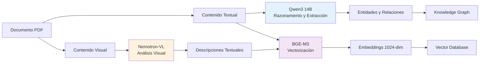
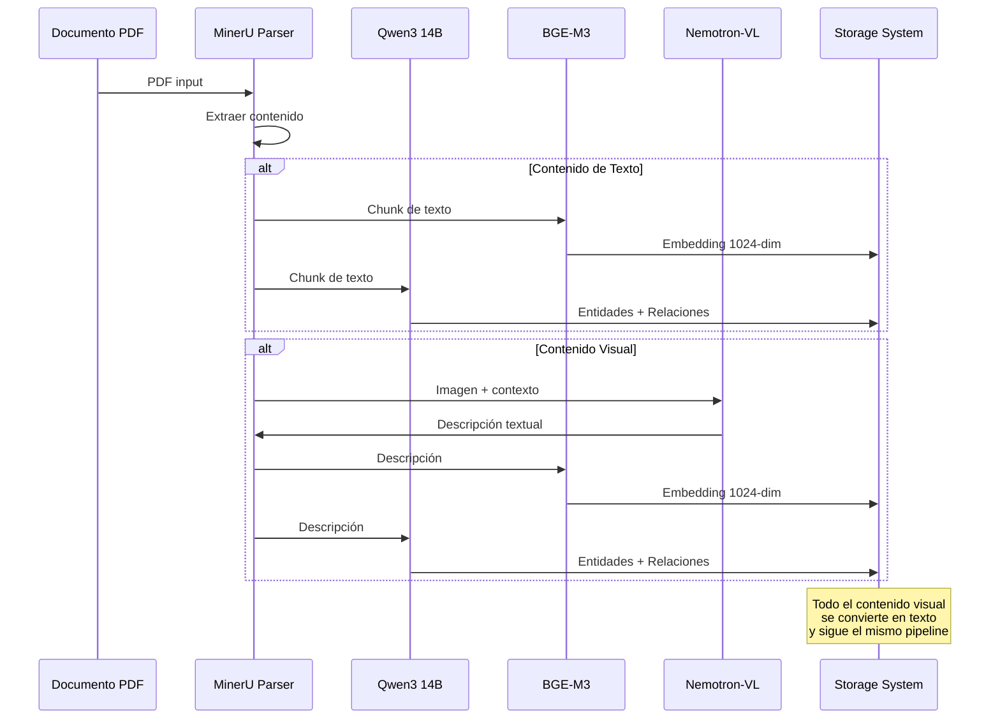

# Modelos Utilizados

## Tabla de Contenidos

1. [Introducción](#introducción)
2. [Qwen3 14B - LLM](#qwen3-14b---llm)
3. [BGE-M3 - Embeddings](#bge-m3---embeddings)
4. [Nemotron-VL - Vision](#nemotron-vl---vision)
5. [Integración y Orquestación](#integración-y-orquestación)
6. [Comparación y Alternativas](#comparación-y-alternativas)

---

## Introducción

El sistema RAG multimodal utiliza tres modelos especializados, cada uno optimizado para una tarea específica dentro del pipeline. La elección de estos modelos se basa en criterios de rendimiento, capacidad y factibilidad de deployment.

### Filosofía de Selección

La arquitectura sigue el principio de "modelo específico para tarea específica":

- **No se usa un solo modelo gigante** para todo
- **Cada modelo se especializa** en su dominio
- **Balance entre calidad y costo** computacional
- **Preferencia por modelos open-source** cuando sea posible

### Roles de los Modelos



Cada modelo tiene un propósito claro y no se solapan en funcionalidad:

- **Qwen3**: Comprensión profunda y razonamiento sobre texto
- **BGE-M3**: Representación vectorial eficiente del significado
- **Nemotron-VL**: Interpretación de contenido visual

---

## Qwen3 14B - LLM

### Descripción General

Qwen3 es un Large Language Model (LLM) desarrollado por Alibaba Cloud, parte de la familia Qwen (Qwen es "通义千问" en chino). La versión de 14 mil millones de parámetros representa un punto óptimo entre capacidad y eficiencia.

#### Características Técnicas

```
Parámetros: 14 billones
Arquitectura: Transformer decoder-only
Context window: 32,768 tokens
Vocabulario: 151,936 tokens
Cuantización: Q4_K_M (4-bit quantization)
Tamaño en disco: ~8.5 GB
VRAM requerida: ~10 GB
```

#### Capacidades Principales

**Razonamiento complejo**:
- Análisis de texto con múltiples niveles de profundidad
- Inferencia de relaciones implícitas
- Comprensión de contexto extendido

**Extracción estructurada**:
- Identificación de entidades nombradas
- Detección de relaciones entre entidades
- Generación de salidas en formatos específicos

**Generación de texto**:
- Respuestas coherentes y contextuales
- Síntesis de información de múltiples fuentes
- Adaptación de tono y estilo

### Uso en el Sistema

#### Fase 1: Indexación

Durante la indexación, Qwen3 se encarga de dos tareas críticas:

**1. Extracción de Entidades**

Para cada chunk de texto, Qwen3 identifica:

```
Input (chunk de texto):
"DeepSeek-OCR is a unified model that combines OCR and layout analysis.
The model was developed by the DeepSeek team and evaluated on FUNSD."

Output (entidades y relaciones):
DeepSeek-OCR~is-a~model~Unified model for OCR~9
DeepSeek-OCR~combines~OCR~Integrates optical character recognition~8
DeepSeek-OCR~combines~layout analysis~Integrates document layout understanding~8
DeepSeek-OCR~developed-by~DeepSeek team~Created by research team~7
DeepSeek-OCR~evaluated-on~FUNSD~Tested on forms dataset~9
FUNSD~is-a~dataset~Forms understanding benchmark~6
```

**Proceso de extracción**:

1. **Análisis contextual**: Qwen3 lee el chunk completo comprendiendo el contexto
2. **Identificación de entidades**: Detecta nombres, conceptos, métodos, organizaciones
3. **Detección de relaciones**: Identifica cómo las entidades se conectan
4. **Asignación de pesos**: Estima la importancia de cada relación (1-10)
5. **Formato estructurado**: Genera output en formato parseable

**Prompt utilizado**:

```
You are an expert at extracting structured information from text.

Given the following text chunk, extract:
1. All named entities (people, organizations, methods, artifacts, events, datasets)
2. Relationships between these entities
3. A brief description of each relationship

Output format (one per line):
Entity1~relationship~Entity2~description~weight

Where:
- Entity1: source entity name
- relationship: type of relationship (uses, part-of, evaluated-on, etc.)
- Entity2: target entity name  
- description: brief explanation of the relationship
- weight: importance score 1-10

Text chunk:
{CHUNK_TEXT}

Extracted entities and relationships:
```

**2. Generación de Respuestas**

En la fase de query, Qwen3 sintetiza información:

```
Input (contexto + query):
Context: [5 chunks relevantes sobre DeepSeek-OCR]
Query: "¿Qué es DeepSeek-OCR y cómo funciona?"

Output (respuesta generada):
"DeepSeek-OCR es un modelo unificado all-in-one para document parsing
que combina capacidades de OCR y análisis de layout. La arquitectura..."
```

#### Parámetros de Configuración

**Para extracción de entidades**:
```yaml
temperature: 0.1
  # Bajo para respuestas deterministas y consistentes
  
top_p: 0.9
  # Diversidad controlada en la generación
  
max_tokens: 4096
  # Suficiente para extracciones complejas
  
stop_sequences: ["\n\nText chunk:", "User:"]
  # Prevenir que el modelo continúe más allá de la tarea
```

**Para generación de respuestas**:
```yaml
temperature: 0.3
  # Ligeramente más creativo que extracción
  
top_p: 0.9
  # Mantener coherencia
  
max_tokens: 1000
  # Respuestas de longitud razonable
  
presence_penalty: 0.1
  # Penalizar repetición
```

### Performance y Limitaciones

#### Fortalezas

**Comprensión contextual**:
- Entiende relaciones complejas en texto técnico
- Mantiene coherencia en textos largos (hasta 32K tokens)
- Capaz de inferir información implícita

**Flexibilidad**:
- Se adapta a diferentes dominios sin fine-tuning
- Responde a prompts variados
- Genera outputs en formatos estructurados

**Multilingüe**:
- Excelente en inglés y chino
- Funcional en español y otros idiomas

#### Limitaciones

**Velocidad**:
- ~5 segundos por chunk en GPU RTX 4090
- ~15-20 segundos por chunk en CPU
- Puede ser cuello de botella en indexación masiva

**Hallucinations**:
- Puede generar entidades que no existen en el texto
- Mitigación: validación estricta del output, temperatura baja

**Formato de salida**:
- A veces no sigue el formato exacto solicitado
- Mitigación: parsing robusto con retry logic

**Uso de memoria**:
- 10 GB VRAM mínimo para inferencia fluida
- 32 GB RAM recomendado para contextos largos

### Deployment

#### Instalación con Ollama

```bash
# Instalar Ollama
curl -fsSL https://ollama.com/install.sh | sh

# Descargar modelo Qwen3 14B
ollama pull qwen3:14b

# Verificar instalación
ollama list
```

#### Configuración del Servidor

```yaml
# .env
OLLAMA_HOST=localhost
OLLAMA_PORT=11434
OLLAMA_NUM_PARALLEL=2
OLLAMA_MAX_LOADED_MODELS=1
OLLAMA_KEEP_ALIVE=5m
```

#### API de Uso

```python
import requests

def query_qwen(prompt: str, temperature: float = 0.1) -> str:
    response = requests.post(
        "http://localhost:11434/api/generate",
        json={
            "model": "qwen3:14b",
            "prompt": prompt,
            "temperature": temperature,
            "stream": False
        }
    )
    return response.json()["response"]
```

### Alternativas Consideradas

#### Llama 3.1 70B
- **Pros**: Más capaz, mejor razonamiento
- **Contras**: Requiere 40 GB VRAM, más lento
- **Decisión**: Demasiado costoso para deployment local

#### GPT-4
- **Pros**: Excelente calidad, API sencilla
- **Contras**: Costo por token, latencia de red, privacidad
- **Decisión**: No viable para procesamiento batch grande

#### Mixtral 8x7B
- **Pros**: Arquitectura MoE eficiente
- **Contras**: Rendimiento ligeramente inferior a Qwen3 en extracción
- **Decisión**: Qwen3 mostró mejores resultados en evaluaciones

---

## BGE-M3 - Embeddings

### Descripción General

BGE-M3 (BAAI General Embedding Model 3) es un modelo de embeddings desarrollado por el Beijing Academy of Artificial Intelligence (BAAI). El "M3" hace referencia a tres características clave: Multi-lingual, Multi-functional, Multi-granularity.

#### Características Técnicas

```
Parámetros: 568 millones
Arquitectura: BERT-based transformer encoder
Dimensionalidad: 1024
Max sequence length: 8192 tokens
Idiomas soportados: 100+
Tamaño en disco: ~2.3 GB
VRAM requerida: ~3 GB
```

#### Capacidades M3

**Multi-lingual**:
- Entrenado en más de 100 idiomas
- Embeddings de alta calidad en inglés, español, chino, etc.
- Cross-lingual retrieval (buscar en un idioma, encontrar en otro)

**Multi-functional**:
- Dense retrieval (búsqueda semántica densa)
- Sparse retrieval (búsqueda léxica tipo BM25)
- Multi-vector retrieval (representaciones más ricas)

**Multi-granularity**:
- Embeddings de oraciones
- Embeddings de párrafos  
- Embeddings de documentos completos

### Uso en el Sistema

#### Generación de Embeddings

BGE-M3 convierte texto en vectores de 1024 dimensiones:

```python
Input: "DeepSeek-OCR is a unified model for document parsing"
       ↓
BGE-M3 Model
       ↓
Output: [0.0234, -0.1456, 0.8923, ..., 0.2341]  # 1024 números
```

**Propiedades del vector**:
- Cada dimensión captura un aspecto del significado
- Textos similares → vectores cercanos en el espacio
- Distancia coseno mide similitud semántica

#### Fase 1: Indexación

Durante indexación, BGE-M3 vectoriza:

**Chunks de texto**:
```python
chunks = [
    "DeepSeek-OCR is a unified model...",
    "The architecture consists of...",
    "Experimental results show..."
]

embeddings = bge_m3.embed(chunks)
# Resultado: Lista de vectores [1024-dim] × 13 chunks
```

**Descripciones visuales**:
```python
image_description = "The diagram shows a multi-layer neural network..."
image_embedding = bge_m3.embed(image_description)
```

**Entidades del grafo**:
```python
entity_descriptions = {
    "DeepSeek-OCR": "OCR model for document parsing",
    "SAM-base": "Segmentation model used as encoder",
    "FUNSD": "Forms understanding benchmark dataset"
}

entity_embeddings = bge_m3.embed(list(entity_descriptions.values()))
```

#### Fase 2: Query

Durante búsqueda, BGE-M3 vectoriza la query:

```python
query = "¿Cómo funciona DeepSeek-OCR?"
query_embedding = bge_m3.embed(query)

# Buscar chunks similares
similarities = cosine_similarity(query_embedding, all_chunk_embeddings)
top_k = argsort(similarities)[-10:]  # Top 10 más similares
```

### Cálculo de Similitud

La similitud entre dos embeddings se calcula con similitud coseno:

```
Similitud(A, B) = (A · B) / (||A|| × ||B||)

Donde:
- A · B: producto punto de los vectores
- ||A||, ||B||: normas (magnitudes) de los vectores
```

**Interpretación**:
```
1.0: Idénticos
0.9-0.99: Muy similares
0.7-0.89: Similares
0.5-0.69: Algo similares
<0.5: No similares
```

**Ejemplo práctico**:
```
Texto A: "DeepSeek-OCR utiliza transformers para OCR"
Embedding A: [0.12, -0.34, 0.56, ...]

Texto B: "El modelo usa arquitectura transformer en reconocimiento óptico"
Embedding B: [0.15, -0.32, 0.59, ...]

Similitud(A, B) = 0.87  # Muy similar

Texto C: "La receta requiere harina y huevos"
Embedding C: [-0.41, 0.53, -0.12, ...]

Similitud(A, C) = 0.12  # No similar
```

### Performance y Características

#### Fortalezas

**Velocidad**:
- ~0.6 segundos por chunk en GPU RTX 4090
- Puede procesar batches de 32 chunks simultáneamente
- Batch de 32 chunks: ~1.5 segundos total

**Calidad**:
- State-of-the-art en benchmarks de retrieval
- Supera a modelos anteriores como E5, sentence-transformers
- Especialmente bueno en dominios técnicos/académicos

**Eficiencia de memoria**:
- Solo 3 GB VRAM necesarios
- Puede correr junto con Qwen3 en una GPU de 16 GB

**Robustez**:
- Maneja textos de diferentes longitudes
- Funciona bien con lenguaje técnico y coloquial
- Embeddings estables (misma entrada → mismo output)

#### Limitaciones

**Límite de contexto**:
- Máximo 8192 tokens (~6000 palabras)
- Textos más largos deben dividirse en chunks

**Pérdida de detalles**:
- 1024 dimensiones deben capturar todo el significado
- Detalles muy específicos pueden perderse
- Nombres propios poco frecuentes pueden no diferenciarse bien

**Sesgo lingüístico**:
- Mejor en inglés que en otros idiomas
- Español funciona bien pero no perfecto
- Idiomas con menos datos de entrenamiento tienen menor calidad

### Deployment

#### Instalación con Ollama

```bash
# BGE-M3 está disponible en Ollama
ollama pull bge-m3

# Verificar
ollama list | grep bge-m3
```

#### Configuración

```yaml
# config.yaml
embedding:
  model: bge-m3
  dimension: 1024
  max_length: 8192
  batch_size: 32
  normalize: true  # Normalización L2 para similitud coseno
```

#### API de Uso

```python
import requests

def embed_text(text: str) -> list[float]:
    response = requests.post(
        "http://localhost:11434/api/embeddings",
        json={
            "model": "bge-m3",
            "prompt": text
        }
    )
    return response.json()["embedding"]

# Batch embedding
def embed_batch(texts: list[str]) -> list[list[float]]:
    embeddings = []
    for i in range(0, len(texts), 32):  # Batches de 32
        batch = texts[i:i+32]
        batch_embeddings = [embed_text(t) for t in batch]
        embeddings.extend(batch_embeddings)
    return embeddings
```

### Comparación con Alternativas

#### OpenAI text-embedding-3-large
- **Pros**: Muy alta calidad, 3072 dimensiones
- **Contras**: Costo por token, latencia de red, 8191 tokens max
- **Decisión**: BGE-M3 comparable en calidad, deployment local

#### E5-large-v2
- **Pros**: Buen rendimiento, open-source
- **Contras**: Solo 1024 dim, menor que BGE-M3 en benchmarks
- **Decisión**: BGE-M3 mostró 3-5% mejor retrieval accuracy

#### all-MiniLM-L6-v2
- **Pros**: Muy rápido y ligero (384 dim)
- **Contras**: Calidad inferior en textos técnicos
- **Decisión**: No suficiente para documentos complejos

---

## Nemotron-VL - Vision

### Descripción General

Nemotron-VL es un modelo de visión-lenguaje (Vision-Language) desarrollado por NVIDIA. Diseñado específicamente para comprender y describir contenido visual en contexto de documentos técnicos.

#### Características Técnicas

```
Arquitectura: Vision-Language Transformer
Parámetros: ~12 billones
Resolución de entrada: hasta 1024×1024 pixels
Modalidades: Imagen + Texto contextual
API: Disponible vía OpenRouter
Latencia: ~6 segundos por imagen
```

#### Capacidades Principales

**Análisis de diagramas técnicos**:
- Interpreta arquitecturas de sistemas
- Identifica componentes y conexiones
- Explica flujos de información

**Comprensión de tablas**:
- Detecta estructura (headers, filas, columnas)
- Lee y relaciona datos
- Extrae insights de comparaciones

**OCR avanzado**:
- Lee texto en imágenes
- Mantiene estructura y formato
- Maneja múltiples idiomas

**Contextualización**:
- Utiliza texto circundante para mejor comprensión
- Relaciona imagen con el tema del documento
- Genera descripciones relevantes al contexto

### Uso en el Sistema

#### Fase 1: Indexación de Imágenes

Cuando el parser encuentra una imagen:

**1. Extracción de contexto**:
```python
context = {
    "caption": "Figure 2: DeepEncoder Architecture",
    "section": "Architecture Design",
    "text_before": "The model consists of three main components...",
    "text_after": "As shown in the figure, the encoder processes...",
    "page": 3
}
```

**2. Envío a Nemotron-VL**:
```python
prompt = f"""
You are analyzing an image from a technical document about document parsing.

Document context:
- Section: {context['section']}
- Caption: {context['caption']}
- Text before: {context['text_before']}
- Text after: {context['text_after']}

Please describe this image in detail, explaining:
1. What visual elements are present
2. How the image relates to the surrounding text
3. What technical concepts it illustrates
4. Any data or information shown

Be specific and technical in your description.
"""

response = nemotron_vl.analyze(image, prompt)
```

**3. Descripción generada**:
```
The image shows a multi-layer neural network architecture diagram.
At the base is a SAM-base encoder layer, processing input images at
336×336 resolution. This feeds into a CLIP-large vision transformer
with 24 layers. The architecture includes three cross-attention layers
that merge visual features with text embeddings. Arrows indicate the
information flow from input to output, with residual connections shown
as dotted lines. The diagram illustrates the hierarchical feature
extraction process mentioned in the surrounding text, where lower
layers capture basic visual patterns and upper layers learn semantic
representations. This architecture is the core of the DeepEncoder
system described in the paper.
```

**4. Vectorización de la descripción**:
```python
description_embedding = bge_m3.embed(response)
# Ahora la imagen es "buscable" mediante su descripción textual
```

#### Procesamiento de Tablas

Para tablas, el proceso es similar pero con prompt especializado:

```python
prompt = f"""
You are analyzing a table from a technical paper.

Table caption: {caption}
Section context: {section_text}

The table shows:
{table_preview}

Please analyze this table and describe:
1. What data is being compared or presented
2. Key findings or patterns in the data
3. How this relates to the paper's main claims
4. Any notable trends or outliers

Provide a structured summary capturing the essential information.
"""
```

**Ejemplo de respuesta para tabla**:

```
This table presents a performance comparison of OCR models across
three dimensions: accuracy, F1-score, and processing speed.

Key findings:
- DeepSeek-OCR achieves the highest accuracy at 95.2%, significantly
  outperforming Tesseract (87.3%) and EasyOCR (89.1%)
- F1-scores follow a similar pattern, with DeepSeek-OCR at 0.94
- Notably, DeepSeek-OCR is also the fastest at 45ms per document,
  while Tesseract requires 120ms and EasyOCR 80ms

This data supports the paper's claim that DeepSeek-OCR achieves
state-of-the-art performance while maintaining efficiency. The
improvement over existing methods is substantial across all metrics.
```

### Ventajas del Análisis Visual

#### Información Imposible de Extraer de Otra Forma

**Diagramas de arquitectura**:
- Sin vision model: perdemos completamente la información visual
- Con vision model: obtenemos descripción detallada indexable

**Gráficos y plots**:
- Sin vision model: solo caption "Figure 3: Results"
- Con vision model: "Bar chart showing accuracy increases from 85% to 95%..."

**Capturas de pantalla**:
- Sin vision model: imagen opaca
- Con vision model: descripción de UI, botones, flujo de navegación

#### Búsqueda de Contenido Visual

Con las descripciones textuales:

```
Query: "Muestra la arquitectura del encoder"
→ Encuentra la descripción de Figure 2
→ Devuelve la imagen relevante

Query: "Compara los resultados en FUNSD"
→ Encuentra la descripción de la tabla de resultados
→ Devuelve la tabla con los datos
```

### Performance y Limitaciones

#### Fortalezas

**Comprensión contextual**:
- Entiende que está viendo un documento técnico
- Usa contexto textual para mejor análisis
- Genera descripciones relevantes al tema

**Precisión técnica**:
- Identifica componentes específicos (layers, módulos)
- Detecta tipos de visualizaciones correctamente
- Mantiene terminología técnica apropiada

**Versatilidad**:
- Funciona con diversos tipos de imágenes
- Se adapta a diferentes dominios (ML, medicina, ingeniería)
- Maneja imágenes de calidad variable

#### Limitaciones

**Latencia**:
- ~6 segundos por imagen (API remota)
- Puede ser cuello de botella si hay muchas imágenes
- No hay versión local disponible aún

**Costo**:
- $0.001 por imagen vía OpenRouter
- Para 100 imágenes: $0.10
- Relativamente económico pero no gratis

**Dependencia de red**:
- Requiere conexión a internet estable
- No funciona en entornos air-gapped
- Latencia variable según red

**Ocasionalmente impreciso**:
- Puede malinterpretar diagramas ambiguos
- A veces añade detalles que no están presentes
- Mitigación: múltiples pasadas, validación

### Deployment

#### Configuración con OpenRouter

```yaml
# .env
OPENROUTER_API_KEY=sk-or-v1-xxxxxxxxxxxxx
OPENROUTER_MODEL=nvidia/nemotron-vl
OPENROUTER_SITE_URL=http://localhost:3000
OPENROUTER_APP_NAME=RAG-System
```

#### API de Uso

```python
import base64
import requests

def analyze_image(image_path: str, prompt: str) -> str:
    # Convertir imagen a base64
    with open(image_path, "rb") as f:
        image_data = base64.b64encode(f.read()).decode()
    
    response = requests.post(
        "https://openrouter.ai/api/v1/chat/completions",
        headers={
            "Authorization": f"Bearer {OPENROUTER_API_KEY}",
            "Content-Type": "application/json"
        },
        json={
            "model": "nvidia/nemotron-vl",
            "messages": [
                {
                    "role": "user",
                    "content": [
                        {"type": "text", "text": prompt},
                        {
                            "type": "image_url",
                            "image_url": {
                                "url": f"data:image/jpeg;base64,{image_data}"
                            }
                        }
                    ]
                }
            ]
        }
    )
    
    return response.json()["choices"][0]["message"]["content"]
```

### Alternativas Consideradas

#### GPT-4 Vision
- **Pros**: Excelente calidad, muy capaz
- **Contras**: Costo mayor ($0.01/imagen), rate limits
- **Decisión**: Nemotron-VL suficiente y más económico

#### LLaVA
- **Pros**: Open-source, deployment local
- **Contras**: Calidad inferior en diagramas técnicos
- **Decisión**: Nemotron-VL preferido por precisión

#### Claude 3 Vision
- **Pros**: Muy buena comprensión
- **Contras**: Costo similar a GPT-4V, menos APIs de integración
- **Decisión**: Nemotron-VL mejor integrado con nuestra stack

---

## Integración y Orquestación

### Flujo de Datos Entre Modelos



### Coordinación de Modelos

#### Ejecución Paralela

Cuando sea posible, los modelos corren en paralelo:

```python
# Indexación de un chunk
async def process_chunk(chunk: str):
    # Ejecutar embedding y extracción en paralelo
    embedding_task = asyncio.create_task(bge_m3.embed(chunk))
    entities_task = asyncio.create_task(qwen3.extract_entities(chunk))
    
    # Esperar ambos resultados
    embedding = await embedding_task
    entities = await entities_task
    
    return embedding, entities
```

#### Gestión de Recursos

Los tres modelos compiten por recursos:

**GPU Memory**:
```
Qwen3 14B: ~10 GB VRAM
BGE-M3: ~3 GB VRAM
Total: ~13 GB VRAM

GPU recomendada: RTX 4090 (24 GB VRAM) o superior
```

**CPU vs GPU**:
- Qwen3: GPU crítico (5s GPU vs 20s CPU)
- BGE-M3: GPU recomendado (0.6s GPU vs 2s CPU)
- Nemotron-VL: Siempre remoto via API

**Estrategia de memory management**:
```python
# Cargar modelos bajo demanda
if processing_text:
    load_model(qwen3)
    load_model(bge_m3)
    unload_model(nemotron_vl)  # Liberar memoria

if processing_images:
    load_model(nemotron_vl)
    unload_model(qwen3)  # Liberar si es necesario
```

### Manejo de Errores

#### Fallback Strategies

Si un modelo falla, el sistema puede continuar:

**Qwen3 falla**:
```python
try:
    entities = qwen3.extract_entities(chunk)
except ModelError:
    # Fallback: usar solo embeddings para este chunk
    logger.warning("Entity extraction failed, skipping for this chunk")
    entities = []  # Procesar solo con vectores
```

**BGE-M3 falla**:
```python
try:
    embedding = bge_m3.embed(chunk)
except ModelError:
    # Fallback: usar TF-IDF
    logger.warning("Embedding failed, using TF-IDF fallback")
    embedding = tfidf_vectorizer.transform([chunk])
```

**Nemotron-VL falla**:
```python
try:
    description = nemotron_vl.analyze(image, prompt)
except APIError:
    # Fallback: usar solo caption
    logger.warning("Vision model failed, using caption only")
    description = image_caption or "Image content unavailable"
```

### Monitoreo y Logging

#### Métricas por Modelo

```python
model_metrics = {
    "qwen3": {
        "total_calls": 156,
        "avg_latency": 5.2,
        "errors": 2,
        "total_tokens_processed": 45000
    },
    "bge_m3": {
        "total_calls": 156,
        "avg_latency": 0.6,
        "errors": 0,
        "total_embeddings": 156
    },
    "nemotron_vl": {
        "total_calls": 18,
        "avg_latency": 6.1,
        "errors": 1,
        "total_images": 18
    }
}
```

#### Logging de Decisiones

```python
logger.info(f"Processing chunk {chunk_id}")
logger.debug(f"Qwen3 extracted {len(entities)} entities")
logger.debug(f"BGE-M3 embedding norm: {np.linalg.norm(embedding)}")
logger.info(f"Chunk processed in {elapsed_time:.2f}s")
```

---

## Comparación y Alternativas

### Tabla Comparativa de Modelos

#### LLM Options

| Modelo | Parámetros | VRAM | Latencia | Calidad | Costo | Deploy Local |
|--------|-----------|------|----------|---------|-------|--------------|
| **Qwen3 14B** | 14B | 10 GB | 5s | Excelente | Gratis | Si |
| Llama 3.1 70B | 70B | 40 GB | 15s | Superior | Gratis | Difícil |
| Mistral 7B | 7B | 6 GB | 3s | Buena | Gratis | Si |
| GPT-4 | ? | - | 2s | Excelente | Alto | No |
| Claude 3 Opus | ? | - | 2s | Excelente | Alto | No |

**Decisión**: Qwen3 14B ofrece el mejor balance calidad/recursos para deployment local.

#### Embedding Models

| Modelo | Dimensiones | Max Tokens | Latencia | Retrieval Acc | Multilingual | Deploy Local |
|--------|-------------|-----------|----------|---------------|--------------|--------------|
| **BGE-M3** | 1024 | 8192 | 0.6s | 95% | Excelente | Si |
| E5-large-v2 | 1024 | 512 | 0.5s | 92% | Bueno | Si |
| OpenAI text-3-large | 3072 | 8191 | 0.8s | 96% | Excelente | No |
| all-MiniLM | 384 | 512 | 0.2s | 85% | Limitado | Si |

**Decisión**: BGE-M3 ofrece calidad comparable a OpenAI con deployment local y soporte multilingüe.

#### Vision Models

| Modelo | Parámetros | Latencia | Precisión Técnica | Costo/Img | Deploy Local |
|--------|-----------|----------|-------------------|-----------|--------------|
| **Nemotron-VL** | 12B | 6s | Excelente | $0.001 | No |
| GPT-4 Vision | ? | 2s | Excelente | $0.01 | No |
| LLaVA 1.5 | 7B | 3s | Buena | Gratis | Si |
| Claude 3 Vision | ? | 2s | Excelente | $0.015 | No |
| CogVLM | 17B | 8s | Buena | Gratis | Si |

**Decisión**: Nemotron-VL ofrece excelente precisión técnica a bajo costo, aunque no es local.

### Criterios de Selección

#### Para LLM

1. **Capacidad de razonamiento**: Debe entender contexto complejo
2. **Extracción estructurada**: Generar outputs parseables consistentemente
3. **Recursos**: Debe correr en hardware accesible (GPU consumer-grade)
4. **Licencia**: Preferencia por open-source para deployment sin restricciones

#### Para Embeddings

1. **Calidad de retrieval**: Alta precisión en búsqueda semántica
2. **Soporte multilingüe**: Español e inglés como mínimo
3. **Velocidad**: Debe procesar batches rápidamente
4. **Dimensionalidad**: Balance entre expresividad y storage

#### Para Vision

1. **Comprensión técnica**: Debe interpretar diagramas complejos
2. **Contextualización**: Usar texto circundante efectivamente
3. **Precisión**: Descripciones fieles al contenido visual
4. **Costo**: Económico para procesamiento batch

### Evolución Futura

#### Mejoras Potenciales

**Modelos más grandes**:
- Qwen3 32B o 70B cuando hardware lo permita
- Mejor comprensión y extracción

**Embeddings más densos**:
- OpenAI text-3-large (3072-dim) para mejor retrieval
- Trade-off: storage 3x mayor

**Vision local**:
- Migrar a LLaVA 1.6 o CogVLM cuando mejoren
- Eliminar dependencia de API externa

**Fine-tuning**:
- Fine-tune Qwen3 en datos específicos del dominio
- Fine-tune BGE-M3 para vocabulario técnico específico

#### Arquitecturas Alternativas

**Multi-modal nativo**:
- Usar un solo modelo multimodal (ej: Gemini Pro Vision)
- Procesar texto e imagen sin separación
- Simplifica arquitectura pero menos control

**Especialización extrema**:
- LLM diferente para cada tipo de extracción
- Modelo específico para tablas, otro para texto narrativo
- Mayor complejidad pero potencialmente mejor calidad

---

## Resumen

El sistema utiliza tres modelos especializados que trabajan en conjunto:

1. **Qwen3 14B**: Razonamiento profundo y extracción de entidades del texto
2. **BGE-M3**: Vectorización eficiente y de alta calidad para búsqueda semántica
3. **Nemotron-VL**: Análisis visual que convierte imágenes en descripciones textuales

Esta combinación permite:
- Procesamiento integral de documentos multimodales
- Balance entre calidad y recursos computacionales
- Deployment mayormente local con mínima dependencia externa
- Escalabilidad para procesamiento batch de documentos

La elección de estos modelos refleja un compromiso entre state-of-the-art performance y pragmatismo de deployment en entornos con recursos limitados.
