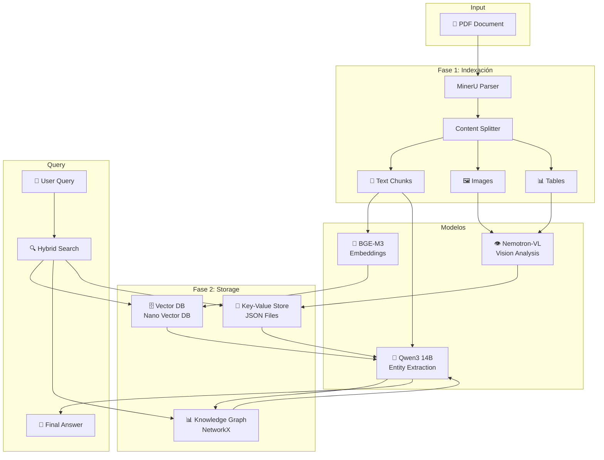
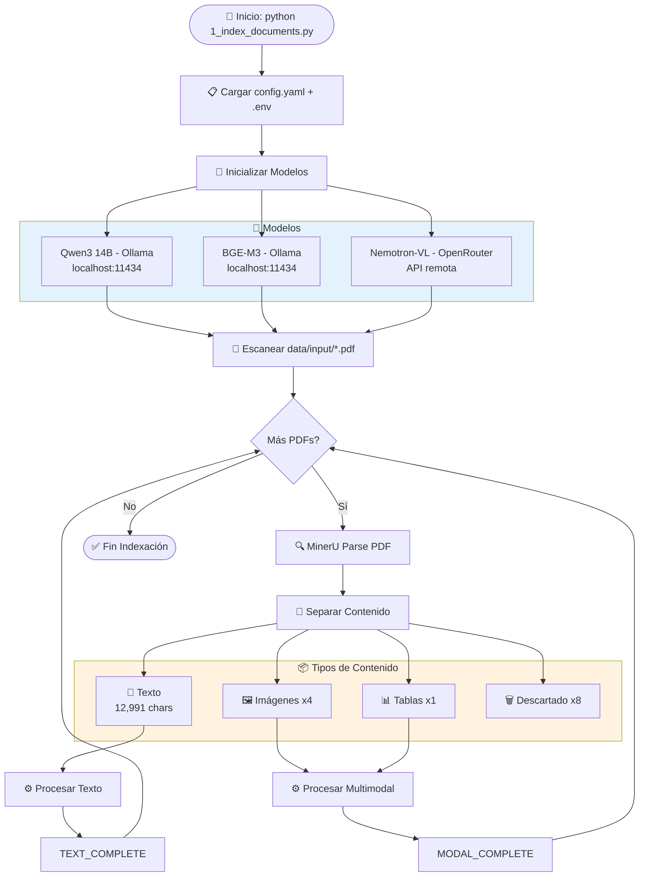
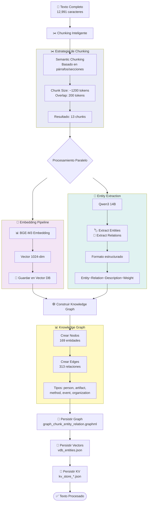
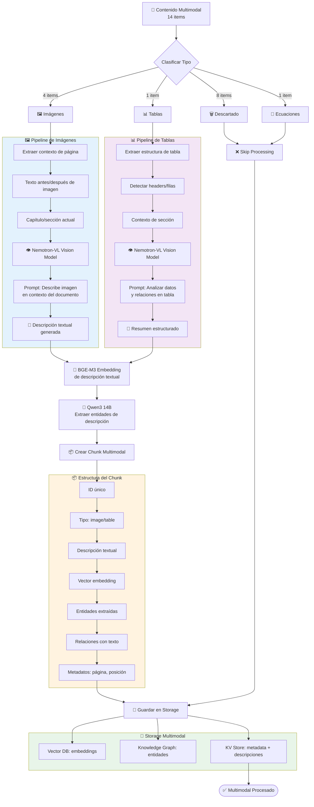
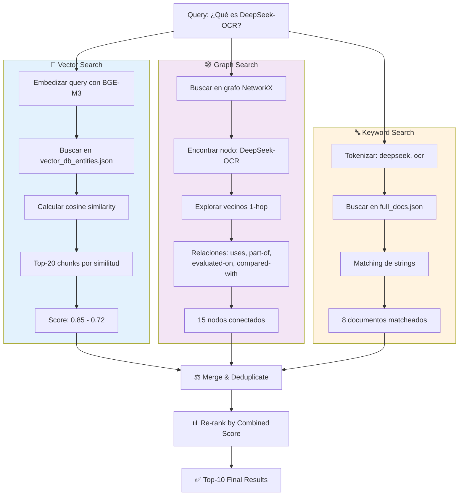
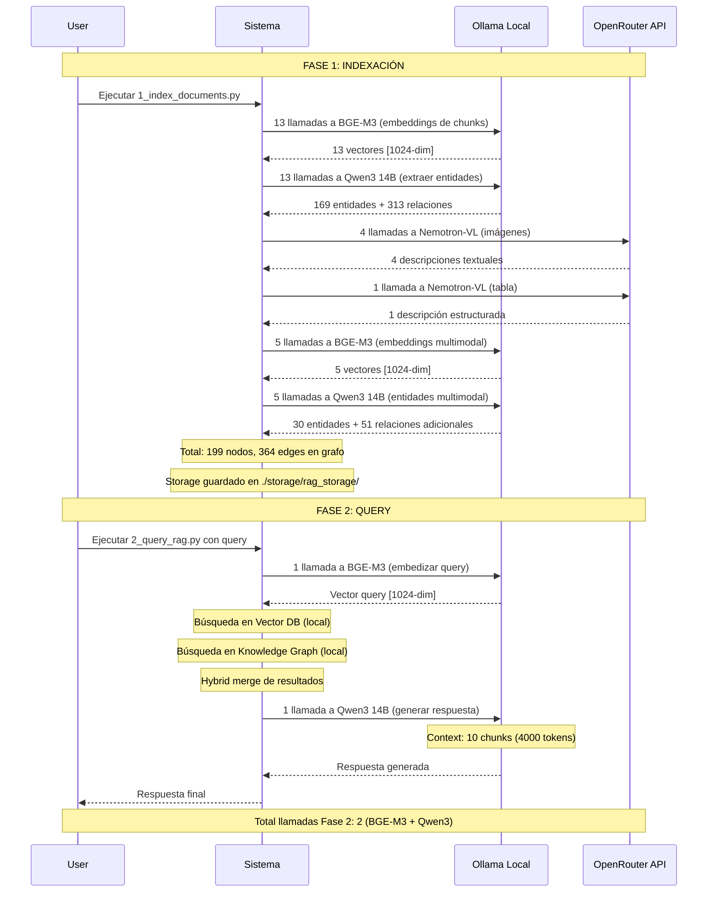
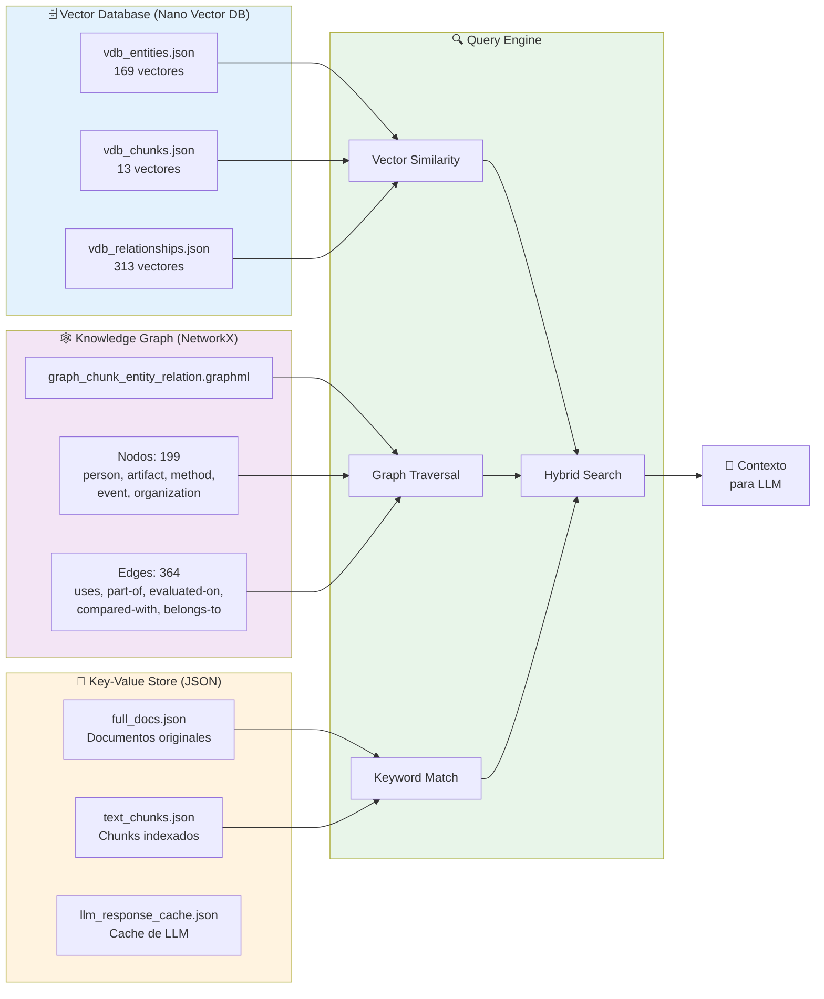
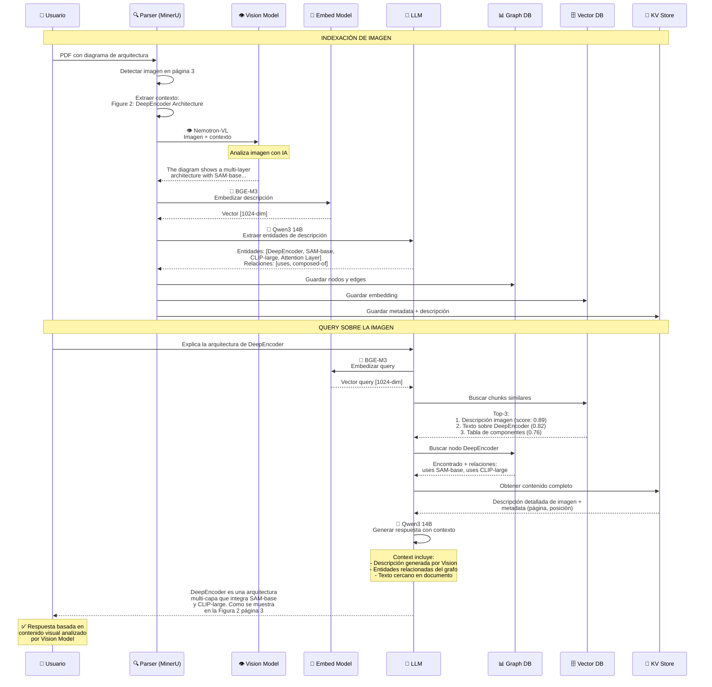

# 🎓 Workshop: RAG Multimodal con LightRAG

## 📋 Índice

1. [Arquitectura General](#arquitectura-general)
2. [Fase 1: Indexación de Documentos](#fase-1-indexación-de-documentos)
3. [Fase 2: Query y Retrieval](#fase-2-query-y-retrieval)
4. [Modelos Utilizados](#modelos-utilizados)
5. [Bases de Datos](#bases-de-datos)
6. [Flujo Completo End-to-End](#flujo-completo-end-to-end)

---

## Arquitectura General



---

## Fase 1: Indexación de Documentos

### 1.1 Flujo Completo de Indexación



### 1.2 Procesamiento de Texto (Detallado)



### 1.3 Procesamiento Multimodal (Detallado)



---

## Fase 2: Query y Retrieval

### 2.1 Flujo Completo de Query

```mermaid
flowchart TD
    START([🚀 Inicio: python 2_query_rag.py])
    
    START --> INPUT[👤 Usuario ingresa query<br/>¿Qué es DeepSeek-OCR?]
    
    INPUT --> LOAD_SYSTEM[🔧 Cargar Sistema]
    
    subgraph LOAD [" 🔧 Carga del Sistema "]
        L1[Cargar modelos LLM + Embed + Vision]
        L2[Conectar a LightRAG storage]
        L3[Cargar Knowledge Graph<br/>199 nodos, 364 edges]
        L4[Cargar Vector DB]
        L5[Cargar KV Store]
    end
    
    LOAD_SYSTEM --> L1
    L1 --> L2
    L2 --> L3
    L3 --> L4
    L4 --> L5
    
    L5 --> EMBED_QUERY[🔢 BGE-M3: Embedizar Query<br/>Vector 1024-dim]
    
    EMBED_QUERY --> HYBRID_SEARCH{🔍 Hybrid Search}
    
    subgraph RETRIEVAL [" 🔍 Estrategia de Retrieval "]
        R1[1️⃣ Local Search<br/>Vector similarity]
        R2[2️⃣ Global Search<br/>Knowledge graph traversal]
        R3[3️⃣ Naive Search<br/>Keyword matching]
    end
    
    HYBRID_SEARCH --> R1
    HYBRID_SEARCH --> R2
    HYBRID_SEARCH --> R3
    
    R1 --> LOCAL_DETAILS
    R2 --> GLOBAL_DETAILS
    R3 --> NAIVE_DETAILS
    
    subgraph LOCAL_DETAILS [" 1️⃣ Local Search (Vector) "]
        LOC1[Buscar en Vector DB]
        LOC2[Top-K=20 chunks similares]
        LOC3[Cosine similarity > 0.7]
        LOC4[📝 Chunks de texto<br/>🖼️ Chunks de imágenes<br/>📊 Chunks de tablas]
    end
    
    subgraph GLOBAL_DETAILS [" 2️⃣ Global Search (Graph) "]
        GLO1[Buscar entidades en grafo]
        GLO2[Encontrar: DeepSeek-OCR node]
        GLO3[Explorar relaciones<br/>1-hop: 15 conexiones<br/>2-hop: 45 conexiones]
        GLO4[Obtener contexto de vecinos]
    end
    
    subgraph NAIVE_DETAILS [" 3️⃣ Naive Search (Keywords) "]
        NAI1[Tokenizar query]
        NAI2[Buscar keywords en KV]
        NAI3[Matching exacto de términos]
        NAI4[Fallback si otros fallan]
    end
    
    LOC1 --> LOC2
    LOC2 --> LOC3
    LOC3 --> LOC4
    
    GLO1 --> GLO2
    GLO2 --> GLO3
    GLO3 --> GLO4
    
    NAI1 --> NAI2
    NAI2 --> NAI3
    NAI3 --> NAI4
    
    LOC4 --> MERGE
    GLO4 --> MERGE
    NAI4 --> MERGE
    
    MERGE[🔗 Merge & Rank Results]
    
    subgraph RANKING [" 📊 Ranking Strategy "]
        RNK1[Eliminar duplicados]
        RNK2[Score ponderado:<br/>Vector: 40%<br/>Graph: 40%<br/>Keyword: 20%]
        RNK3[Re-rank por relevancia]
        RNK4[Top-10 chunks finales]
    end
    
    MERGE --> RNK1
    RNK1 --> RNK2
    RNK2 --> RNK3
    RNK3 --> RNK4
    
    RNK4 --> BUILD_CONTEXT
    
    BUILD_CONTEXT[📝 Construir Contexto]
    
    subgraph CONTEXT [" 📝 Context Building "]
        CTX1[Chunk 1: Texto principal]
        CTX2[Chunk 2: Descripción de imagen]
        CTX3[Chunk 3: Datos de tabla]
        CTX4[Chunk 4-10: Contexto adicional]
        CTX5[Entidades relacionadas del grafo]
        CTX6[Total: ~4000 tokens]
    end
    
    BUILD_CONTEXT --> CTX1
    CTX1 --> CTX2
    CTX2 --> CTX3
    CTX3 --> CTX4
    CTX4 --> CTX5
    CTX5 --> CTX6
    
    CTX6 --> GENERATE
    
    GENERATE[🤖 Qwen3 14B: Generar Respuesta]
    
    subgraph GENERATION [" 🤖 Response Generation "]
        GEN1[System Prompt:<br/>Eres un asistente experto...]
        GEN2[User Query + Contexto]
        GEN3[Temperature: 0.1<br/>Max tokens: 2048]
        GEN4[Streaming response]
    end
    
    GENERATE --> GEN1
    GEN1 --> GEN2
    GEN2 --> GEN3
    GEN3 --> GEN4
    
    GEN4 --> OUTPUT[💬 Respuesta Final al Usuario]
    
    OUTPUT --> LOG[📊 Log Metrics]
    
    subgraph METRICS [" 📊 Métricas "]
        M1[Tiempo total: ~12s]
        M2[Chunks recuperados: 10]
        M3[Tokens usados: 4521]
        M4[Modelo LLM: Qwen3 14B]
        M5[Fuentes: texto + imagen + tabla]
    end
    
    LOG --> M1
    M1 --> M2
    M2 --> M3
    M3 --> M4
    M4 --> M5
    
    M5 --> END([✅ Fin Query])
    
    style LOAD fill:#E3F2FD
    style RETRIEVAL fill:#FFF3E0
    style LOCAL_DETAILS fill:#E8F5E9
    style GLOBAL_DETAILS fill:#F3E5F5
    style NAIVE_DETAILS fill:#FFF9C4
    style RANKING fill:#FCE4EC
    style CONTEXT fill:#E0F2F1
    style GENERATION fill:#F1F8E9
    style METRICS fill:#EFEBE9
```



### 2.2 Detalle de Hybrid Search



---

## Modelos Utilizados

### Tabla Comparativa

| Modelo | Uso | Proveedor | Dimensión | Velocidad | Cuándo se Usa |
|--------|-----|-----------|-----------|-----------|---------------|
| **Qwen3 14B** | LLM para extracción de entidades y generación de respuestas | Ollama (local) | - | ~2s/chunk | Fase 1: Extracción de entidades<br/>Fase 2: Generación de respuesta |
| **BGE-M3** | Embeddings de texto | Ollama (local) | 1024-dim | ~100ms/texto | Fase 1: Vectorizar chunks<br/>Fase 2: Vectorizar query |
| **Nemotron-VL** | Análisis de imágenes y tablas | OpenRouter (API) | - | ~3-5s/imagen | Fase 1: Describir imágenes/tablas |

### Flujo de Llamadas a Modelos



---

## Bases de Datos

### Estructura del Storage

```
storage/rag_storage/
├── graph_chunk_entity_relation.graphml   # Knowledge Graph (NetworkX)
│   └── 199 nodos, 364 edges
│
├── vdb_entities.json                     # Vector DB - Entidades
│   └── Embeddings de entidades extraídas
│
├── vdb_chunks.json                       # Vector DB - Chunks de texto
│   └── Embeddings de chunks originales
│
├── vdb_relationships.json                # Vector DB - Relaciones
│   └── Embeddings de descripciones de relaciones
│
├── kv_store_full_docs.json              # KV Store - Documentos completos
│   └── Metadata + texto completo por documento
│
├── kv_store_text_chunks.json            # KV Store - Chunks de texto
│   └── ID → contenido de chunk
│
├── kv_store_llm_response_cache.json     # Cache de respuestas LLM
│   └── Hash prompt → respuesta (evita recomputar)
│
└── doc_status.json                       # Estado de procesamiento
    └── Qué documentos están indexados
```

### Diagrama de Bases de Datos



### Ejemplo de Datos

#### Knowledge Graph Node (GraphML)
```xml
<node id="DeepSeek-OCR">
  <data key="d0">DeepSeek-OCR</data>
  <data key="d1">artifact</data>
  <data key="d2">DeepSeek-OCR is an optical compression method...</data>
  <data key="d3">chunk-7fe438c1c7cd83852645bb40d56fc405</data>
  <data key="d4">deepseek-ocr-paper_origin.pdf</data>
</node>
```

#### Vector DB Entry (JSON)
```json
{
  "DeepSeek-OCR": {
    "embedding": [0.023, -0.145, 0.892, ..., 0.234],  // 1024 dimensiones
    "metadata": {
      "type": "artifact",
      "source_chunk": "chunk-7fe438c1c...",
      "created_at": 1763128318
    }
  }
}
```

#### KV Store Entry (JSON)
```json
{
  "chunk-7fe438c1c7cd83852645bb40d56fc405": {
    "content": "DeepSeek-OCR: All-in-One Document Parsing...",
    "doc_id": "doc-393ccdd531c2dfc29c581ffbc9530c69",
    "file_path": "deepseek-ocr-paper_origin.pdf",
    "chunk_order": 1,
    "tokens": 487
  }
}
```

---

## Flujo Completo End-to-End

### Escenario Real: Pregunta sobre Imagen



---

## 📊 Métricas del Sistema

### Performance

| Métrica | Fase 1 (Indexación) | Fase 2 (Query) |
|---------|---------------------|----------------|
| **Tiempo total** | ~140 segundos | ~12 segundos |
| **Llamadas LLM** | 18 (Qwen3) | 1 (Qwen3) |
| **Llamadas Embedding** | 18 (BGE-M3) | 1 (BGE-M3) |
| **Llamadas Vision** | 5 (Nemotron) | 0 |
| **Chunks procesados** | 13 texto + 5 multimodal | - |
| **Nodos en grafo** | 199 | - |
| **Edges en grafo** | 364 | - |
| **Storage size** | ~15 MB | - |

### Costos (Estimados)

| Servicio | Fase 1 | Fase 2 | Costo Unitario |
|----------|--------|--------|----------------|
| **Ollama (local)** | Gratis | Gratis | $0 |
| **OpenRouter Vision** | 5 llamadas | 0 | ~$0.005/imagen |
| **Total por documento** | ~$0.025 | ~$0.00 | - |

---

## 🎯 Puntos Clave para la Clase

### 1. **Chunking Inteligente**
- No es corte arbitrario, respeta semántica
- Overlap para mantener contexto
- ~1200 tokens por chunk

### 2. **Triple Storage**
- Vector DB: búsqueda por similitud
- Knowledge Graph: relaciones semánticas
- KV Store: datos crudos y metadata

### 3. **Modelos Especializados**
- LLM: razonamiento y extracción
- Embeddings: vectorización eficiente
- Vision: análisis multimodal

### 4. **Hybrid Search**
- Combina 3 estrategias diferentes
- Mejor recall que un solo método
- Re-ranking para mejor precision

### 5. **Procesamiento Multimodal**
- Vision model convierte imagen → texto
- Texto se procesa igual que contenido textual
- Unificación en el grafo de conocimiento

---

## 🔧 Comandos Rápidos

```bash
# Indexar documentos
python 1_index_documents.py

# Hacer query
python 2_query_rag.py "¿Qué es DeepSeek-OCR?"

# Visualizar grafo
# Abrir: storage/rag_storage/graph_chunk_entity_relation.graphml en yEd
python fix_graphml_for_yed.py  # Añadir labels primero

# Ver estructura del storage
ls -lh storage/rag_storage/
```

---

## 📚 Recursos Adicionales

- **Documentación LightRAG**: https://github.com/HKUDS/LightRAG
- **RAG-Anything**: https://github.com/HKUDS/RAG-Anything
- **MinerU Parser**: https://github.com/opendatalab/MinerU
- **BGE Embeddings**: https://huggingface.co/BAAI/bge-m3

---

## ✨ Conclusión

Este sistema RAG multimodal combina:
- ✅ Parsing inteligente de documentos complejos
- ✅ Múltiples estrategias de storage (Vector + Graph + KV)
- ✅ Procesamiento especializado por tipo de contenido
- ✅ Búsqueda híbrida de alta calidad
- ✅ Generación de respuestas con contexto rico

**Resultado**: Respuestas precisas que integran texto, imágenes y tablas de forma unificada.

